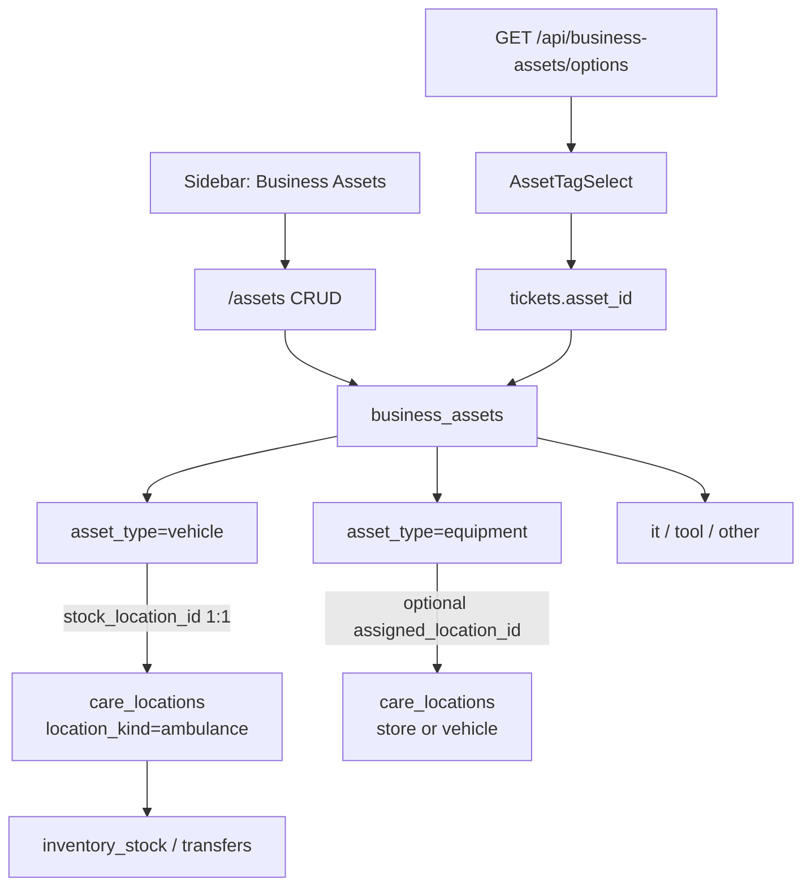

# Business Assets Management — Comprehensive Plan

**Version:** 1.1.0  
**Status:** Implemented (schema `0020`–`0024`, APIs, `/assets` UI, vehicle kind + stationed-at, ticket asset picker, fleet sync)  
**Last Updated:** July 19, 2026  
**Product:** uventorybiz `1.1.0`  
**Related docs:** [E_TICKETING_STAFF_PLAN.md](./E_TICKETING_STAFF_PLAN.md), [AMBULANCE_MANAGEMENT_AND_INVENTORY_PLAN.md](./AMBULANCE_MANAGEMENT_AND_INVENTORY_PLAN.md), [INVENTORY_TRANSFERS_AND_ISSUES_PLAN.md](./INVENTORY_TRANSFERS_AND_ISSUES_PLAN.md), [MOBILE_STORE_AND_FLEET_INVENTORY.md](./MOBILE_STORE_AND_FLEET_INVENTORY.md), [SIDEBAR_CATEGORIZATION.md](./SIDEBAR_CATEGORIZATION.md), [RBAC.md](./RBAC.md)

---

## Table of Contents

1. [Executive overview](#1-executive-overview)
2. [Goals and non-goals](#2-goals-and-non-goals)
3. [Current state and problem](#3-current-state-and-problem)
4. [Design principles](#4-design-principles)
5. [Domain model](#5-domain-model)
6. [Data model](#6-data-model)
7. [Asset tags](#7-asset-tags)
8. [Vehicles and fleet](#8-vehicles-and-fleet)
9. [Equipment vs inventory catalog](#9-equipment-vs-inventory-catalog)
10. [Ticketing integration](#10-ticketing-integration)
11. [API surface](#11-api-surface)
12. [UI and navigation](#12-ui-and-navigation)
13. [RBAC and feature flags](#13-rbac-and-feature-flags)
14. [Migration and backfill](#14-migration-and-backfill)
15. [Implementation phases](#15-implementation-phases)
16. [Risks and open decisions](#16-risks-and-open-decisions)
17. [Acceptance criteria](#17-acceptance-criteria)

---

## 1. Executive overview

### Purpose

Introduce a **first-class Business Assets register** for fixed assets owned or used by a tenant — **equipment, vehicles (fleet), IT, tools, and other** — with:

- **CRUD** under **Business Assets** nav (`/assets` overview; fleet ops under `/fleets/*`)
- **Auto-assigned asset tags** (immutable, unique per tenant)
- **Dropdown pickers** anywhere a form asks for an asset tag (starting with staff tickets)
- **Fleet captured as assets** with `asset_type = vehicle`, while on-board stock continues to use linked inventory locations
- **Equipment tracking** moved off sellable catalog items onto the assets register

### Business value

- One register for “things we own/operate,” separate from “things we sell/stock.”
- Reliable references on tickets and repairs (no free-text tag drift).
- Fleet visible as tagged assets without discarding the existing location-based stock model.
- Cleaner product language: **Asset Tracking** instead of inventory-category “Equipment Tracking.”

### High-level architecture

---

## 2. Goals and non-goals

### Goals

1. **Separate register** — `business_assets` is not `inventory_items`. Sellable SKUs stay in the catalog; fixed assets live in the assets table.
2. **Auto tags** — Every asset gets a tenant-unique tag at create time; tags are never user-edited.
3. **Typed assets** — At least: `equipment`, `vehicle`, `it`, `tool`, `other`.
4. **Fleet as vehicles** — Existing and new fleet units are represented as `asset_type=vehicle` assets; each vehicle has a **1:1 stock location** for on-board inventory.
5. **Business Assets nav** — Sidebar group **Business Assets** with children: All assets (`/assets`), Fleet (`/fleets`), Pre-start (`/fleets/pre-start`), On-board inventory (`/fleets/inventory`). Do **not** use `/fleet#…` hash children (broken nested nav).
6. **Ticket linkage** — Ticket forms use a fetched asset dropdown; persist `asset_id` (display tag via join).
7. **Retire Equipment Tracking UI** — Redirect `/equipment-tracking` to `/assets` (optionally `?type=equipment`).
8. **Tenant isolation** — All asset data scoped by `tenant_id`.

### Non-goals (v1)

- Depreciation, book value, or finance fixed-asset ledger.
- Rewriting on-board stock to hang directly off `business_assets` (stock remains on linked `care_locations`).
- Using `/fleet#…` hash tabs as sidebar URLs (use real `/fleets/*` paths instead).
- Full CAD/dispatch, GPS tracking, or external fleet telematics.
- Making portal users manage business assets.
- Hard-deleting assets that are referenced by tickets (prefer soft-retire).

---

## 3. Current state and problem

| Area | Today | Problem |
|------|--------|---------|
| Fleet | Sidebar group → `/fleet` hash tabs; vehicles = `care_locations` with `location_kind=ambulance`; APIs still `/api/ambulances*` | Good for stock; not a tagged asset register; nav is fleet-centric |
| Equipment Tracking | `/equipment-tracking` filters `inventory_items` where `category=equipment` | Mixes fixed assets with sellable catalog / POS |
| Maintenance | `equipment_maintenance.equipment_id` → `inventory_stock.id` | Tied to stock lines, not a durable asset identity |
| Tickets | `tickets.asset_tag` free-text varchar | No master list; typos; no FK; plan mentioned `related_equipment_id` but it was never built |
| Tags | No `asset_tag` on inventory or locations | Nothing to feed a dropdown |

Canonical fleet paths today: `/fleet`, `/fleet/units/:id` (legacy ambulance redirects exist). There is **no** `/fleets` route yet; this plan standardizes fleet-as-filter under `/assets?type=vehicle` and redirects old fleet URLs.

---

## 4. Design principles

1. **Assets ≠ inventory catalog.** Catalog items can still be sold or stocked; assets are tracked instances the business operates.
2. **Tags are system-owned.** Generated once; used as the human-visible identity in pickers and tickets.
3. **Vehicles stay inventory-capable via location.** Creating a vehicle asset also provisions (or links) a `care_locations` stock site so transfers and on-board qty keep working ([AMBULANCE_MANAGEMENT_AND_INVENTORY_PLAN.md](./AMBULANCE_MANAGEMENT_AND_INVENTORY_PLAN.md)).
4. **One nav surface.** Operators find assets in one place; type filters replace separate Fleet / Equipment Tracking menu items.
5. **Forms never free-type tags.** Any UI that needs an asset reference uses `AssetTagSelect` (or equivalent) over `/api/business-assets/options`.
6. **Soft lifecycle.** Prefer `retired` / inactive linked location over hard delete when history exists.

---

## 5. Domain model

### Asset types

| Type | Meaning | Notable fields |
|------|---------|----------------|
| `equipment` | Tools/machines previously tracked under Equipment Tracking | serial, brand, model, maintenance dates |
| `vehicle` | Fleet unit | call sign, registration plate, fleet number, ops status, **required** `stock_location_id` |
| `it` | Computers, phones, networking gear | serial, brand, model |
| `tool` | Smaller tracked tools | serial optional |
| `other` | Catch-all | minimal required fields |

### Status vs ops status

- **`status`** (all assets): lifecycle — `active` \| `in_repair` \| `retired` \| `lost`
- **`ops_status`** (vehicles only): operational readiness — `available` \| `deployed` \| `standby` \| `out_of_service` (maps from today’s `ambulance_ops_status`)

### Relationships

- **Vehicle → stock location:** required 1:1 (`stock_location_id` unique when set).
- **Non-vehicle → assigned location:** optional (`assigned_location_id`) — store or vehicle stock site where the asset is stationed.
- **Ticket → asset:** optional `tickets.asset_id` FK.

---

## 6. Data model

### 6.1 Table `business_assets`

| Column | Type | Notes |
|--------|------|--------|
| `id` | UUID PK | |
| `tenant_id` | FK → tenants | Required |
| `asset_tag` | varchar | Unique per tenant; server-generated |
| `name` | varchar | Required |
| `description` | text | Optional |
| `asset_type` | varchar/enum | `equipment` \| `vehicle` \| `it` \| `tool` \| `other` |
| `status` | varchar/enum | `active` \| `in_repair` \| `retired` \| `lost` |
| `serial_number` | varchar | Optional |
| `brand` | varchar | Optional |
| `model` | varchar | Optional |
| `call_sign` | varchar | Vehicle; validated when type=vehicle |
| `registration_plate` | varchar | Vehicle |
| `fleet_number` | varchar | Vehicle |
| `ops_status` | varchar | Vehicle only; null otherwise |
| `stock_location_id` | FK → care_locations | **Required for vehicles**; null otherwise; unique when not null |
| `assigned_location_id` | FK → care_locations | Optional for non-vehicles |
| `purchase_date` | date | Optional |
| `warranty_expiry` | date | Optional |
| `last_maintenance_date` | date | Optional |
| `next_maintenance_date` | date | Optional |
| `notes` | text | Optional |
| `created_at` | timestamptz | |
| `updated_at` | timestamptz | |

**Indexes**

- Unique `(tenant_id, asset_tag)`
- Index `(tenant_id, asset_type)`
- Unique `stock_location_id` WHERE NOT NULL
- Index `assigned_location_id`, `status`

### 6.2 Tickets

| Change | Notes |
|--------|--------|
| Add `asset_id` | Nullable FK → `business_assets.id` |
| `asset_tag` column | Keep temporarily for display/back-compat **or** stop writing it and resolve tag via join; prefer join + optional denormalized snapshot on create |

API write path accepts `assetId`; UI does not accept free-text tags.

### 6.3 What we do not change in v1

- `inventory_items` / `inventory_stock` / transfer tables — unchanged.
- `care_location_kind` value `'ambulance'` — keep DB enum; UI copy already says vehicle/fleet.
- `equipment_maintenance` — leave as-is for v1; maintenance dates live on `business_assets`. Remap in a later phase if needed.

---

## 7. Asset tags

### Format

- Pattern: `AST-` + zero-padded sequence, e.g. `AST-000001`
- Scope: **per tenant**
- Assignment: **only on INSERT**; never PATCH-able

### Generation

- Server-side in the business-assets create service (transactional with the insert).
- Prefer a tenant counter strategy that avoids races (e.g. advisory lock, or `INSERT … RETURNING` against a small `tenant_asset_tag_counters` table). The counter stores the **last issued** sequence number (first asset → insert `1`; subsequent → increment). Backfill must set `MAX(AST-######)`, not `MAX+1`.

### Consumption

- List/detail show tag prominently (copy-to-clipboard optional).
- `GET /api/business-assets/options` returns `{ id, assetTag, name, assetType, status }` for selects.
- Ticket UI binds `assetId`; label shows `AST-000042 — Generator (equipment)`.

---

## 8. Vehicles and fleet

### Create vehicle asset

In one DB transaction:

1. Create `care_locations` row: `location_kind=fleet`, name/code derived from call sign / fleet number, map ops status.
2. Insert `business_assets` with `asset_type=vehicle`, generated `asset_tag`, `stock_location_id` = new location id.
3. Return the asset (include linked location id for stock UIs).

Vehicles require at least one of: call sign, registration plate, or fleet number.

### Update / retire

- Patch vehicle fields; sync linked location display name / ops / active flag when relevant.
- Soft-retire: set asset `status=retired`, set linked location inactive / `out_of_service`; do not orphan stock without an admin path.
- Asset type cannot be changed to/from `vehicle` (retire and create instead).
- Deleting a fleet location via `/api/fleet` retires the linked business asset first.

### Backfill

For each existing `care_locations` where `location_kind=fleet`:

- Create `business_assets` row: type `vehicle`, `stock_location_id=location.id`
- Map `call_sign`, `registration_plate`, `fleet_number`, `ambulance_ops_status` → `ops_status`
- `name` from location name or call sign
- Generate `asset_tag`

### Legacy routes

| From | To |
|------|-----|
| `/fleet`, `/fleet#fleet` | `/fleets` |
| `/fleet#pre-start` | `/fleets/pre-start` |
| `/fleet#inventory` | `/fleets/inventory` |
| `/fleet/units/:id` | `/fleets/units/:id` |

Fleet ops live under `/fleets/*`; the tagged register remains `/assets` (filter `?type=vehicle` optional).

---

## 9. Equipment vs inventory catalog

| Concept | Table | Role |
|---------|--------|------|
| Sellable / stocked SKU | `inventory_items` (+ `inventory_stock`) | Catalog, POS, POs, transfers |
| Tracked fixed asset | `business_assets` | Identity, tag, maintenance, ticket refs |

**Optional backfill:** For `inventory_items` with `category=equipment` that have meaningful serial/maintenance data, create a corresponding `business_assets` row (`type=equipment`). **Do not delete** catalog rows — they may still be sellable.

**UI:** Remove Equipment Tracking from Inventory sidebar; `/equipment-tracking` redirects to `/assets` or `/assets?type=equipment`.

---

## 10. Ticketing integration

Aligned with [E_TICKETING_STAFF_PLAN.md](./E_TICKETING_STAFF_PLAN.md):

1. Replace free-text “Asset Tag / Equipment Ref” with **`AssetTagSelect`**.
2. Create/update ticket APIs accept `assetId` (nullable).
3. Detail view shows linked tag + name; link to `/assets/:id` when permitted.
4. Fleet lodge-ticket dialogs use the same select (may filter by location / type later).
5. Do **not** invent a parallel `related_equipment_id` to inventory; assets are the canonical FK.

Portal support tickets: out of scope unless they later need asset refs (staff tickets first).

---

## 11. API surface

Module: `server/modules/business-assets/`  
Mount under `/api/business-assets` (auth + tenant scope).

| Method | Path | Description |
|--------|------|-------------|
| GET | `/api/business-assets` | List; query: `q`, `status`, `assetType`, `assignedLocationId` |
| GET | `/api/business-assets/options` | Lightweight picker payload |
| GET | `/api/business-assets/:id` | Detail including tag, type fields, linked location ids |
| POST | `/api/business-assets` | Create; server assigns tag; vehicle path provisions stock location |
| PATCH | `/api/business-assets/:id` | Update; **reject** attempts to change `assetTag` |
| DELETE | `/api/business-assets/:id` | Soft-retire preferred; sync vehicle location when applicable |

**Tickets:** extend create/update schemas with `assetId`; stop accepting free-text `assetTag` as the write path (or ignore it if present).

**Legacy:** `/api/ambulances*` may remain temporarily for stock/pre-start; prefer routing new UI through business-assets for vehicle identity. Consolidation of ambulance APIs is a follow-up.

---

## 12. UI and navigation

### Sidebar ([`client/src/config/sidebarConfig.tsx`](../client/src/config/sidebarConfig.tsx))

- **Business Assets** dropdown:
  - **All assets** → `/assets`
  - **Fleet** → `/fleets`
  - **Pre-start checks** → `/fleets/pre-start`
  - **On-board inventory** → `/fleets/inventory`
- Do **not** use `/fleet#…` hash URLs in the sidebar.
- **Remove** Equipment Tracking from Inventory Management.
- Access: same roles as today’s fleet module (`fleet_operator`, `staff`, `admin`, `super_admin`) unless product tightens later.

### Pages

| Route | Purpose |
|-------|---------|
| `/assets` | Register overview (list + filters including Vehicle) |
| `/fleets` | Vehicle register |
| `/fleets/pre-start` | Pre-start checks |
| `/fleets/inventory` | On-board stock by vehicle |
| `/fleets/units/:id` | Unit detail (stock, transfers, activity) |
| `/equipment-tracking` | Redirect → `/assets` |
| `/fleet`, `/fleet#…` | Redirect → matching `/fleets/*` path |

### Shared component

`AssetTagSelect` — async options from `/api/business-assets/options`; used on ticket new/edit and any future form that needs an asset reference.

### Forms

- Type selector drives which fields are shown/required (vehicle vs equipment).
- Tag field is **read-only** after create (shown as generated value on success).

---

## 13. RBAC and feature flags

### Roles

Reuse fleet module access helpers initially (`hasFleetModuleAccess` / `requireFleetModuleAccess`). Rename helpers/docs to “business assets” when convenient; behavior unchanged unless specified.

### Feature flag

- Keep platform flag key `fleet` initially to avoid breaking existing toggles.
- Update **display name / description** to **Business Assets** (vehicles + equipment register).
- Optional later: introduce `business_assets` key and migrate.

---

## 14. Migration and backfill

1. Drizzle migration: create `business_assets`; add `tickets.asset_id` (+ FK/index).
2. Fleet backfill SQL/script: ambulance `care_locations` → vehicle assets (see [§8](#8-vehicles-and-fleet)).
3. Optional equipment backfill from catalog (see [§9](#9-equipment-vs-inventory-catalog)).
4. Ticket free-text `asset_tag`: leave as-is unless exact match to a new tag; no blind conversion.
5. Seeds: none required beyond empty register; tags start at `AST-000001` per tenant on first create.

---

## 15. Implementation phases

### Phase 1 — Foundation (ship)

- Schema + tag generator + CRUD APIs + options endpoint
- `/assets` list/detail UI + sidebar swap (remove Fleet children + Equipment Tracking)
- Vehicle create provisions stock location; fleet backfill
- Redirects from `/fleet*` and `/equipment-tracking`
- Ticket forms: `AssetTagSelect` + `assetId`
- Docs: this file + CHANGELOG + sidebar/ticketing cross-links

### Phase 2 — Depth (follow-up)

- Asset detail: on-board stock / transfers / pre-start entry points for vehicles
- Remap or replace `equipment_maintenance` to `business_assets.id`
- Deprecate or wrap `/api/ambulances*` behind business-assets
- Optional equipment catalog backfill tooling in admin UI

### Phase 3 — Optional

- Finance fields / depreciation
- Asset QR labels / print tags
- Portal-visible asset refs (unlikely)

---

## 16. Risks and open decisions

| Risk / decision | Mitigation / default |
|-----------------|----------------------|
| Dual identity (vehicle asset + location) confuses APIs | Document `stock_location_id` as the stock key; asset id as identity/tag key |
| Concurrent tag generation collisions | Transactional counter / lock |
| Existing tickets with free-text tags | Keep display; new tickets use FK only |
| `equipment_maintenance` still on stock lines | Defer remap; dates on asset row for v1 |
| Flag key still named `fleet` | Display rename only until a dedicated migration |

---

## 17. Acceptance criteria

- [x] Tenant admin/staff with access can create/list/edit/retire assets at `/assets`.
- [x] Every new asset receives a unique `AST-######` tag; tag cannot be changed.
- [x] Creating a **vehicle** also creates a linked ambulance-kind `care_locations` row and sets `stock_location_id`.
- [x] Existing fleet locations are backfilled as vehicle assets.
- [x] Sidebar shows **Business Assets** with All assets + Fleet / Pre-start / On-board inventory children (real `/fleets/*` paths; no Equipment Tracking under Inventory).
- [x] `/fleet*` redirects to `/fleets/*`; `/equipment-tracking` redirects to `/assets`.
- [x] Ticket create/edit uses a dropdown of assets; persists `asset_id`.
- [x] Options endpoint is tenant-scoped and suitable for select components.
- [x] Absolute separation preserved: no requirement that assets exist as `inventory_items`.

---

## Document history

| Version | Date | Notes |
|---------|------|--------|
| 1.1.0 | 2026-07-19 | Phase 1 implemented |
| 1.0.0 | 2026-07-19 | Initial comprehensive plan prior to implementation |
