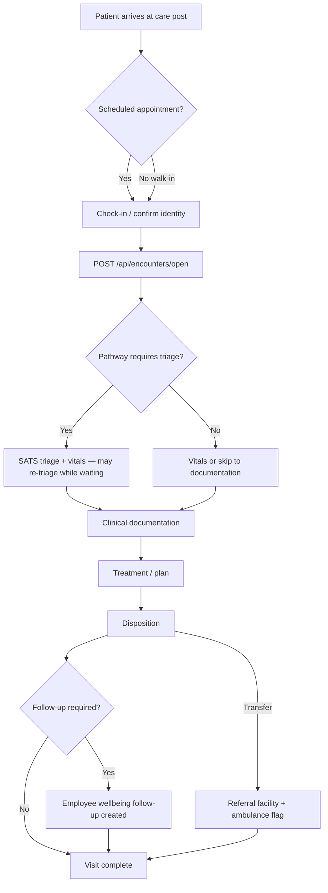
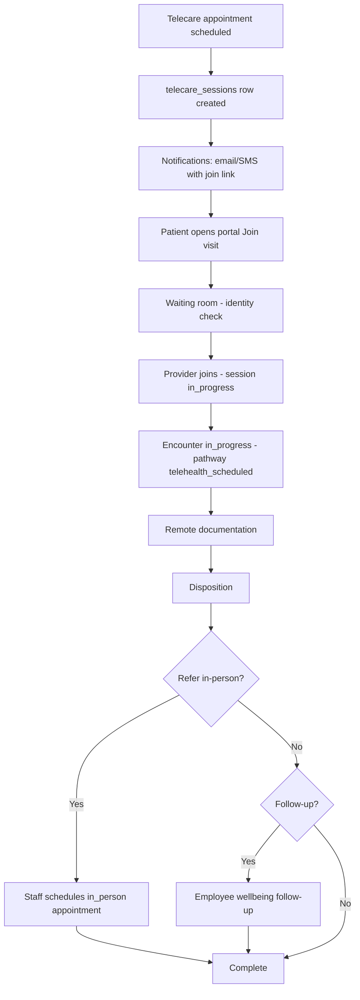
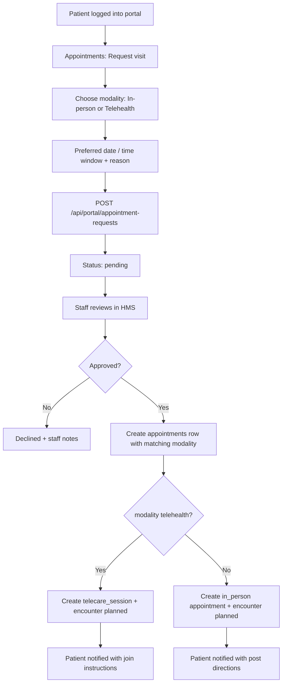
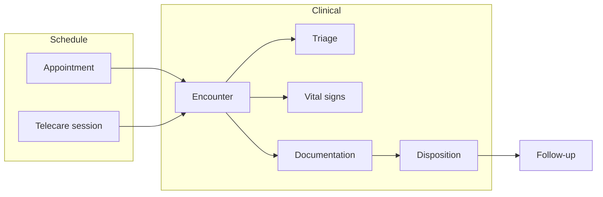

# Encounter Lifecycle Framework

**Version:** 1.1.0  
**Status:** Encounter-first model implemented — see [ENCOUNTER_FIRST_MODEL.md](./ENCOUNTER_FIRST_MODEL.md) (v1) and [ENCOUNTER_FIRST_MODEL_V2_ADDENDUM.md](./ENCOUNTER_FIRST_MODEL_V2_ADDENDUM.md) (current UI/enums)  
**Last updated:** June 12, 2026  
**Related:** [ENCOUNTER_FIRST_MODEL.md](./ENCOUNTER_FIRST_MODEL.md), [ENCOUNTER_FIRST_MODEL_V2_ADDENDUM.md](./ENCOUNTER_FIRST_MODEL_V2_ADDENDUM.md), [INCIDENT_STATUS_LIFECYCLE.md](./INCIDENT_STATUS_LIFECYCLE.md), [BACKEND_ARCHITECTURE.md](./BACKEND_ARCHITECTURE.md), [PATIENT_PORTAL_PLAN.md](./PATIENT_PORTAL_PLAN.md), [WELLBEING_MODULE_PLAN.md](./WELLBEING_MODULE_PLAN.md), [REFERRAL_FACILITIES_AND_DISPOSITION.md](./REFERRAL_FACILITIES_AND_DISPOSITION.md), [VITALS_TRIAGE_AND_MEDICAL_VISIT_PLAN.md](./VITALS_TRIAGE_AND_MEDICAL_VISIT_PLAN.md), [APPOINTMENT_NOTIFICATIONS.md](./APPOINTMENT_NOTIFICATIONS.md), [TELEHEALTH_PLAN.md](./TELEHEALTH_PLAN.md)

**Code references:** `shared/encounterPathways.ts`, `shared/schema.ts` (`encounters`, `telecare_sessions`, `resource_identifiers`)

---

## Table of contents

1. [Executive summary](#1-executive-summary)
2. [Conceptual framework](#2-conceptual-framework)
3. [Pathway matrix](#3-pathway-matrix)
4. [Encounter lifecycle states](#4-encounter-lifecycle-states)
5. [Patient flow — in-person (onsite)](#5-patient-flow--in-person-onsite)
6. [Patient flow — telecare (scheduled virtual visit)](#6-patient-flow--telecare-scheduled-virtual-visit)
7. [Patient flow — portal appointment request](#7-patient-flow--portal-appointment-request)
8. [Staff flow — scheduling to disposition](#8-staff-flow--scheduling-to-disposition)
9. [Disposition and follow-up](#9-disposition-and-follow-up)
10. [FHIR alignment (conceptual)](#10-fhir-alignment-conceptual)
11. [Data model summary](#11-data-model-summary)
12. [Implementation phases](#12-implementation-phases)

---

## 1. Executive summary

MineAid uses an **encounter-first clinical model**: every presentation opens an **`encounters`** row at arrival; triage, vitals, and documentation attach to that episode; **discharge** closes it. This supports:

- **In-person** care at fixed posts and ambulance units  
- **Telecare** (video) for scheduled visits, follow-ups, and **patient-initiated portal requests** — telecare is **not** limited to follow-ups  
- **Phone** follow-ups as a lighter modality  
- **Pathway-driven workflows** that turn clinical steps on/off (e.g. SATS triage for acute onsite; vitals-only for monitoring)  
- **Re-triage while waiting** — no same-calendar-day gate; multiple triage rows per encounter  
- Future **HL7 FHIR** export without a second data model  

The **`encounters`** table (renamed from `medical_visits` in staging) is the clinical episode. **`telecare_sessions`** manage video lifecycle. **`appointments`** and **`portal_appointment_requests`** feed the schedule layer with an explicit **`modality`** (`in_person` | `telehealth` | `phone`).

---

## 2. Conceptual framework

### 2.1 Layers

```
┌─────────────────────────────────────────────────────────────────┐
│  SCHEDULE          appointments · portal requests · telecare    │
│                    sessions (join links, waiting room)          │
├─────────────────────────────────────────────────────────────────┤
│  ENCOUNTER         encounters (episode shell: pathway, modality,  │
│                    status, links to schedule + session)         │
├─────────────────────────────────────────────────────────────────┤
│  CLINICAL DATA     triage · vital_signs (observations) ·       │
│                    documentation (HPI, exam, assessment, plan)  │
├─────────────────────────────────────────────────────────────────┤
│  OUTCOME           disposition · work restrictions · follow-up  │
│                    (Employee wellbeing) · referral / transfer           │
├─────────────────────────────────────────────────────────────────┤
│  INTEROP (future)  resource_identifiers · FHIR bundles          │
└─────────────────────────────────────────────────────────────────┘
```

### 2.2 Core distinctions

| Dimension | Field / concept | Examples |
|-----------|-----------------|----------|
| **Why** (clinical reason) | `visit_type` | monitoring, procedure, clinical, routine, injury, illness, follow_up, pre_employment, annual, emergency |
| **How** (delivery) | `modality` | in_person, telehealth, phone |
| **Workflow template** | `pathway` | vitals_monitoring, procedure, acute_onsite, routine_clinic, telehealth_scheduled, … |
| **Episode state** | `status` | planned → arrived → in_progress → finished |

**Visit type** and **modality** are independent. A `follow_up` can be in-person or telehealth. A patient can request a **routine telehealth** visit from the portal (`telehealth_scheduled` pathway), not only a post-discharge follow-up.

### 2.3 Actors

| Actor | Surfaces | Responsibilities |
|-------|----------|------------------|
| **Patient / employee** | Patient portal | Request appointments (in-person or telehealth), join virtual visits, view summaries |
| **Medical staff** | Staff HMS | Triage, document encounter, disposition, schedule telecare |
| **Admin** | Settings, portal admin | Enable portal telecare, configure telecare provider |
| **Referral partner** (future) | FHIR API | Receive transfer bundles |

### 2.4 Design principles

1. **One encounter per clinical episode** — linked to at most one appointment and one telecare session.  
2. **Pathway rules in code** — `shared/encounterPathways.ts` is the matrix; UI and API validate against it.  
3. **Observations normalized** — vitals live in `vital_signs`; encounter row may retain legacy vitals columns during transition but new writes prefer `vital_signs`.  
4. **Tenant isolation** — unchanged; every row carries `tenant_id`.  
5. **Audit everything** — staff `audit_logs`, portal `portal_audit_events`, telecare session state changes.

---

## 3. Pathway matrix

> **Superseded for staff UI (June 2026):** The pathway matrix below describes the **v1** workflow model. Current implementation uses encounter **type** + **`triageRequired`** per [ENCOUNTER_FIRST_MODEL_V2_ADDENDUM.md](./ENCOUNTER_FIRST_MODEL_V2_ADDENDUM.md). The `pathway` column remains as an internal slug for FHIR/reporting.

Canonical definitions live in **`shared/encounterPathways.ts`**. Summary:

| Pathway | Modalities | Same-day triage gate | Triage required | Typical entry |
|---------|------------|----------------------|-----------------|---------------|
| `acute_onsite` | in_person | Yes | Yes | Walk-in injury/illness |
| `routine_clinic` | in_person | Yes | Yes | Walk-in or staff-scheduled clinic |
| `telehealth_scheduled` | telehealth | No | No | **Portal or staff scheduled virtual visit** |
| `telehealth_follow_up` | telehealth | No | No | Post-visit remote follow-up |
| `phone_follow_up` | phone | No | No | Employee wellbeing phone follow-up |
| `pre_employment` | in_person, telehealth | No | No | HR/medical clearance |
| `annual_screening` | in_person, telehealth | No | No | Periodic OH review |
| `emergency` | in_person | Yes | Yes | Emergency visit type |

### 3.1 Clinical steps by pathway

| Step | acute_onsite | routine_clinic | telehealth_scheduled | telehealth_follow_up | phone_follow_up |
|------|:------------:|:----------------:|:--------------------:|:--------------------:|:---------------:|
| Registration | ● | ● | ● | ○ | ○ |
| Triage (SATS) | ● | ● | ○ | ○ | ○ |
| Vitals | ● | ● | ○ | ○ | ○ |
| Subjective (HPI) | ● | ● | ● | ● | ● |
| Physical exam / ABCDE | ● | ○ | ○ | ○ | ○ |
| Assessment | ● | ● | ● | ● | ● |
| Plan / treatment | ● | ● | ● | ● | ○ |
| Disposition | ● | ● | ● | ● | ● |
| Follow-up scheduling | ○ | ○ | ○ | ○ | ○ |

● = required · ○ = optional / skipped by default

### 3.2 Disposition options by pathway

| Disposition | acute / routine / emergency | telehealth_* | phone_follow_up |
|-------------|:---------------------------:|:------------:|:---------------:|
| return_to_work | ● | ● | ● |
| transferred_to_hospital | ● | ○ | ○ |
| transferred_to_hospital_other | ● | ○ | ○ |
| refer_in_person | ○ | ● | ● |
| continue_telehealth | ○ | ● | ● |
| unable_to_assess_remote | ○ | ● | ○ |
| light_duty / medical_leave | ○ | ● | ○ |

---

## 4. Encounter lifecycle states

Aligned with FHIR `Encounter.status` (MineAid superset):

```
planned ──► arrived ──► triaged ──► in_progress ──► finished
   │            │           │              │
   └────────────┴───────────┴──────────────┴──► cancelled
                                                entered_in_error
```

| Status | In-person meaning | Telecare meaning |
|--------|-------------------|------------------|
| `planned` | Appointment exists; patient not yet at post | Session scheduled; join links not yet active |
| `arrived` | Patient checked in at location | Patient in waiting room (portal or pre-join) |
| `triaged` | SATS triage completed (pathway requires it) | N/A for most telehealth pathways |
| `in_progress` | Clinician documenting visit | Video session active |
| `finished` | Disposition recorded; chart closed | Session ended; disposition recorded |
| `cancelled` | Did not attend / cancelled | No-show or cancelled session |

**Telecare session** (`telecare_sessions.status`) runs in parallel: `scheduled` → `waiting_room` → `in_progress` → `completed` | `no_show` | `cancelled` | `failed`.

---

## 5. Patient flow — in-person (onsite)

End-to-end from arrival at the medical post through disposition.



### Step detail

1. **Arrival** — Patient presents at `care_locations` (fixed_site). Staff selects patient; `location_id` set from active session location.  
2. **Encounter open** — `POST /api/encounters/open`; `status = arrived`.  
3. **Triage** — For pathways with `triageRequired`: staff may triage and **re-triage** while the encounter is open.  
4. **Documentation** — Chief complaint, HPI, ABCDE/SAMPLE where required, assessment, treatment.  
5. **Discharge** — `POST /api/encounters/:id/discharge` sets `status = finished` and disposition.  
6. **Follow-up** — If `follow_up_required`, auto-create `patient_follow_ups` (Employee wellbeing) with type `in_person`, `phone_call`, or `telehealth` as chosen by staff.

---

## 6. Patient flow — telecare (scheduled virtual visit)

Telecare applies to **any scheduled virtual visit**, including initial/routine requests — not only follow-ups.



### Step detail

1. **Schedule** — Staff creates `appointments` with `modality = telehealth` **or** patient submits portal request with `preferred_modality = telehealth` (see §7).  
2. **Session provisioning** — Server creates `telecare_sessions`; provider SDK generates room/token (Phase 2+).  
3. **Pre-visit** — Portal shows upcoming visit; reminder notifications.  
4. **Join** — Patient: `/portal/visits/:sessionId/join`. Staff: encounter workspace or appointments card.  
5. **Encounter** — `pathway = telehealth_scheduled` (or `telehealth_follow_up` if linked to prior visit). No SATS gate. Vitals optional (self-reported).  
6. **Disposition** — Includes telehealth-specific outcomes: `refer_in_person`, `unable_to_assess_remote`, `continue_telehealth`.  
7. **Escalation** — `refer_in_person` triggers staff workflow to book onsite appointment.

---

## 7. Patient flow — portal appointment request

Patients may request **in-person or telehealth** appointments from the portal.



### Portal request fields

| Field | Purpose |
|-------|---------|
| `preferred_modality` | `in_person` or `telehealth` (required) |
| `preferred_date` | Optional date preference |
| `preferred_time_window` | e.g. "Morning", "14:00–16:00" |
| `reason` | Free text for triage by staff |
| `linked_appointment_id` | Set when staff confirms |

Staff confirmation sets `pathway` from modality:

- `in_person` → `routine_clinic` (default) or mapped from reason  
- `telehealth` → `telehealth_scheduled` (default) — **not** forced to `telehealth_follow_up`

---

## 8. Staff flow — scheduling to disposition



### Entry points

| Entry | Creates | Default pathway |
|-------|---------|-----------------|
| Walk-in at post | Encounter (no appointment) | From `visit_type` + `in_person` |
| Staff appointment (in-person) | Appointment + planned encounter | `routine_clinic` |
| Staff appointment (telehealth) | Appointment + telecare_session + planned encounter | `telehealth_scheduled` |
| Portal request (telehealth) | Request → staff confirms → same as staff telehealth | `telehealth_scheduled` |
| Employee wellbeing follow-up due | Follow-up row; staff starts visit | `telehealth_follow_up` or `phone_follow_up` |
| Post-triage | Triage row → open encounter | `acute_onsite` / `emergency` |

### Appointment alerts

When appointments are scheduled or patients act in the portal (confirm, decline, cancel) or a visit is marked no-show, MineAid sends **patient emails** where applicable and **staff in-app alerts** only. The assigned provider always receives in-app notifications; if no staff have notification preferences for an appointment type, alerts fall back to active `medical_staff`, `emt`, and `admin` users. Staff email is disabled for now to reduce alert fatigue.

See [APPOINTMENT_NOTIFICATIONS.md](./APPOINTMENT_NOTIFICATIONS.md) for the full event matrix, recipient rules, and planned **clinic scheduling coordinator** role for future routing.

---

## 9. Disposition and follow-up

### 9.1 Disposition recording

- Recorded on `encounters` (`disposition`, `disposition_date_time`, transfer fields).  
- Hospital transfer: `transfer_facility_id`, `ambulance_used` (in-person only).  
- Work restrictions: `work_restrictions` text.  
- `follow_up_required` triggers Employee wellbeing integration (existing behavior).

### 9.2 Follow-up types (Employee wellbeing)

| follow_up_type | Modality | Next encounter pathway |
|----------------|----------|------------------------|
| `in_person` | in_person | `routine_clinic` |
| `phone_call` | phone | `phone_follow_up` |
| `telehealth` | telehealth | `telehealth_follow_up` |

Follow-up completion may spawn a **new encounter** linked via `patient_follow_ups.medical_visit_id` / `encounter_id`.

---

## 10. FHIR alignment (conceptual)

| MineAid | FHIR R4 |
|---------|---------|
| `encounters` | `Encounter` |
| `encounters.modality` | `Encounter.class` + virtual detail extension |
| `encounters.pathway` | `Encounter.type` (ValueSet TBD) |
| `vital_signs` | `Observation` |
| `triage` | Prior encounter or triage observations |
| `appointments` + `telecare_sessions` | `Appointment` + `virtualService` |
| `resource_identifiers` | `Patient.identifier`, `Encounter.identifier` |
| Disposition + transfer | `Encounter.hospitalization`, `ServiceRequest` |

See **[FHIR_INTEROPERABILITY_FLOWS.md](./FHIR_INTEROPERABILITY_FLOWS.md)** for care-transfer flows and API details.

---

## 11. Data model summary

### New / renamed tables

| Table | Role |
|-------|------|
| `encounters` | Clinical episode (renamed from `medical_visits`) |
| `telecare_sessions` | Video session lifecycle |
| `resource_identifiers` | FHIR-ready identifier registry |

### Key new columns on `encounters`

- `modality`, `pathway`, `appointment_id`, `telecare_session_id`, `patient_location_note`  
- `status` extended to lifecycle enum values (varchar)

### Key new columns on `appointments`

- `modality`, `encounter_id`, `telecare_session_id`

### Key new column on `portal_appointment_requests`

- `preferred_modality` — **`in_person` | `telehealth`**

### Backward compatibility

- `medicalVisits`, `medicalRecords` remain **TypeScript aliases** for `encounters`.  
- API paths `/api/medical-visits` remain until clients migrate to `/api/encounters`.  
- `vital_signs.medical_visit_id` retained; references `encounters.id`.

---

## 12. Implementation phases

| Phase | Deliverable | Status |
|-------|-------------|--------|
| **1** | Pathway matrix, schema, migration | Done |
| **2** | Encounter-first API (`open`, `discharge`, `encounterId` on triage/vitals) | Done — see [ENCOUNTER_FIRST_MODEL.md](./ENCOUNTER_FIRST_MODEL.md) |
| **3** | Pathway-driven encounter workspace UI (`/medical-visit`) | Done |
| **4** | Telecare session + video provider | In progress |
| **5** | FHIR read/write facade | In progress — see [FHIR_INTEROPERABILITY_FLOWS.md](./FHIR_INTEROPERABILITY_FLOWS.md) |
| **6** | Extend encounter shell to tests, inventory, incidents | Planned |
| **7** | Vitals deduplication (writes only to `vital_signs`) | Planned |

---

## Appendix A — Sequence: portal telehealth request to finished encounter

```
Patient          Portal API           Staff HMS           Telecare svc
   |                 |                    |                    |
   |-- request ------>|                    |                    |
   |  (telehealth)   |                    |                    |
   |                 |-- pending row ---->|                    |
   |                 |                    |-- review --------->|
   |                 |                    |-- confirm appt ---->|
   |                 |                    |-- create session -->|
   |                 |                    |                    |-- room
   |<-- notification-|                    |                    |
   |-- join -------->|                    |                    |
   |                 |--------------------|-- start encounter ->|
   |<======== video session ==================================>|
   |                 |                    |-- disposition ---->|
   |<-- summary ------|                    |                    |
```

---

## Appendix B — Glossary

| Term | Definition |
|------|------------|
| **Encounter** | A single clinical episode between patient and care team |
| **Pathway** | Template defining required steps and dispositions |
| **Modality** | How care is delivered (in person, video, phone) |
| **Telecare** | Real-time remote clinical interaction (typically video) |
| **Visit type** | Clinical reason/category for the encounter |
