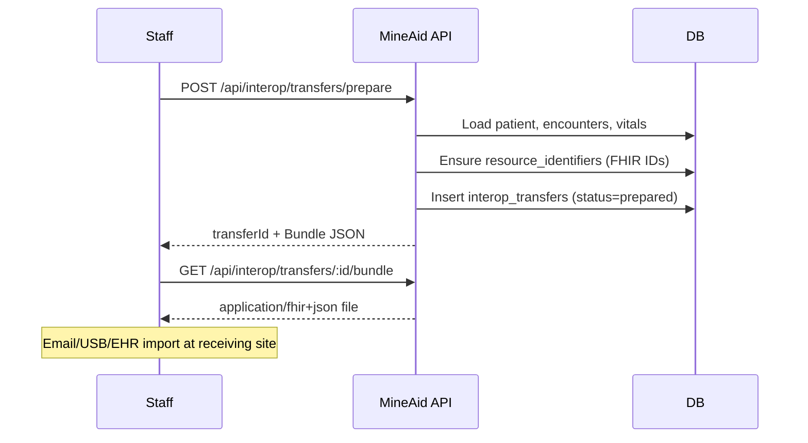
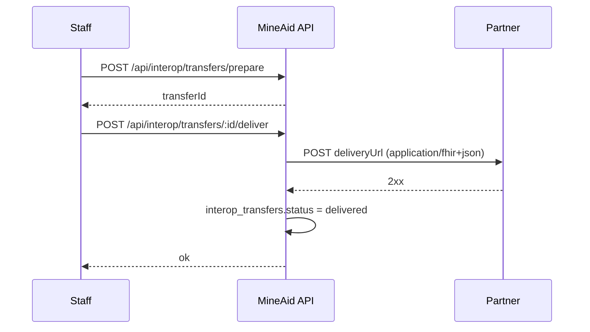
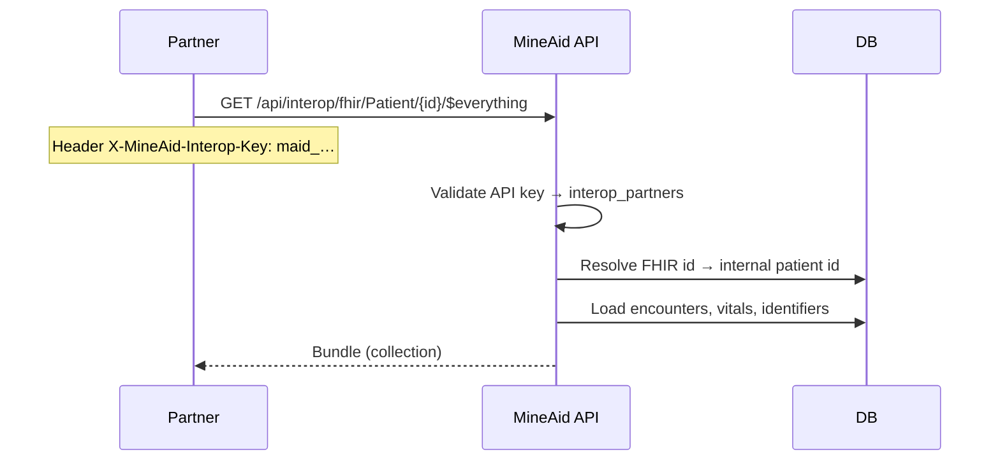
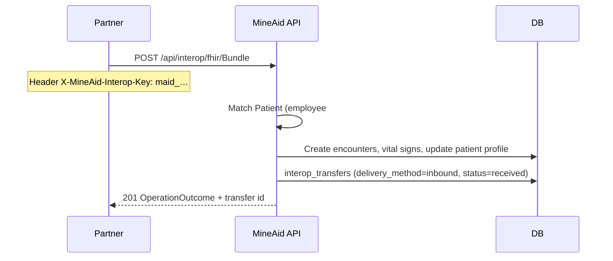
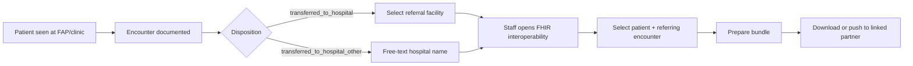

# FHIR Interoperability — Care Transfer Flows

**Version:** 1.0.0  
**Last updated:** June 8, 2026  
**Related:** [ENCOUNTER_LIFECYCLE_FRAMEWORK.md](./ENCOUNTER_LIFECYCLE_FRAMEWORK.md), [REFERRAL_FACILITIES_AND_DISPOSITION.md](./REFERRAL_FACILITIES_AND_DISPOSITION.md), [ENCOUNTER_SCHEMA_MIGRATION.md](./ENCOUNTER_SCHEMA_MIGRATION.md)

**Code:** `server/modules/fhir/`, `server/modules/interop/`, `client/src/pages/Interoperability.tsx`

---

## 1. Purpose

When a patient **leaves the mine-site clinic** and continues care at a **hospital or external facility**, receiving clinicians need structured clinical data—not PDFs alone. MineAid exports **HL7 FHIR R4** bundles mapped from the existing encounter-centric model (`encounters`, `vital_signs`, `patients`, `referral_facilities`) without maintaining a second clinical database.

This document describes:

- Actors and trust boundaries  
- End-to-end transfer flows (push and pull)  
- FHIR resource mapping  
- API endpoints and configuration  
- Failure handling and audit  

---

## 2. Actors

| Actor | Role |
|-------|------|
| **Sending clinic (MineAid tenant)** | Documents encounter, records hospital transfer disposition, prepares FHIR bundle |
| **Medical staff** | Uses **Healthcare Management → FHIR interoperability** to prepare/download/push bundles |
| **Tenant admin** | Registers **interop partners**, delivery URLs, rotates inbound API keys |
| **Receiving facility** | Accepts `document` Bundle via HTTPS POST and/or pulls `Patient/$everything` with API key |
| **Referral facility record** | Optional link between disposition dropdown and interop partner |

---

## 3. Trigger — when to send data

Typical triggers (align with disposition workflow):

1. **Transferred to hospital** — disposition `transferred_to_hospital` with `transfer_facility_id`  
2. **Transferred to hospital (other)** — disposition `transferred_to_hospital_other` with free-text facility  
3. **Refer in person** (telehealth) — escalation to onsite/hospital care  
4. **Manual export** — staff prepares bundle for continuity of care without a specific disposition  

The interoperability UI lets staff select **which encounters** to include (defaults to the five most recent if none selected).

---

## 4. Flow A — Staff prepares and downloads bundle



**Use when:** receiving facility has no HTTPS endpoint yet, or requires manual import.

---

## 5. Flow B — Staff pushes bundle to partner



**Partner setup (admin):**

1. **Admin → FHIR interoperability → Partner facilities → Add partner**  
2. Set **Delivery URL** (partner endpoint that accepts `Bundle`)  
3. Optional **Delivery bearer token** (stored server-side; sent as `Authorization: Bearer …`)  
4. Copy **inbound API key** (shown once) if partner will also **pull** data  

**Failure handling:**

| Failure | System behaviour |
|---------|------------------|
| Partner URL unreachable | `status=failed`, `error_message` stored; staff can retry **Push** from history |
| Partner returns 4xx/5xx | Same; error snippet logged in transfer row |
| Missing delivery URL | Prepare still works; push returns 409 with clear message |
| Empty patient / no encounters | Prepare returns 500; no transfer row with invalid bundle |

---

## 6. Flow C — Partner pulls patient record (inbound API key)

Receiving facility (or middleware) can read FHIR resources without staff manually pushing:



**Authentication:**

- Header `X-MineAid-Interop-Key: {key}` **or** `Authorization: Bearer {key}`  
- Key prefix `maid_` + 64 hex chars; only shown once at partner creation/rotation  

**Scoped to:** partner's `tenant_id` — keys never cross tenants.

---

## 6b. Flow C2 — Partner pushes bundle (inbound ingest)

When a **referring hospital** sends a FHIR `Bundle` to MineAid (reverse of Flow B):



**Patient matching (required):** at least one of:

- `identifier` with system `https://mineaidhms.com/internal-id` (MineAid patient UUID)
- `identifier` with system `https://mineaidhms.com/employee-number`
- `name` + `birthDate` matching an employee/patient in the tenant

**Idempotency:** encounter `id` values are stored per partner; re-posting the same bundle skips already-imported encounters.

**Imported data:**

- `Patient` extensions → allergies, medical history, medications on patient record
- `Encounter` → medical visit (status `finished`, notes tagged with partner name)
- `Observation` (LOINC vitals) → `vital_signs` rows linked to imported encounters

---



**Tip:** Link **interop partner** to **referral facility** so Organization resources in the bundle match the disposition dropdown.

---

## 8. FHIR resource mapping (R4)

| MineAid | FHIR R4 | Notes |
|---------|---------|--------|
| `patients` + `employees` | `Patient` | Names, DOB, gender, telecom; allergies/history/meds as extensions |
| `encounters` | `Encounter` | status, class (AMB/VR), type/pathway, period, disposition extensions |
| `vital_signs` + encounter vitals columns | `Observation` | LOINC-coded vital signs |
| `tenants` | `Organization` | Sending site |
| `referral_facilities` | `Organization` | Receiving facility (when linked) |
| Transfer summary | `Composition` | LOINC 34133-9 summarization note |
| Export wrapper | `Bundle` | `type=document` for transfers; `collection` for `$everything` |

**Stable identifiers:** `resource_identifiers` assigns a UUID per patient/encounter per tenant. FHIR `Patient.id` / `Encounter.id` use that UUID; `https://mineaidhms.com/internal-id` carries MineAid primary keys for round-trip.

**Identifier systems:**

```
{FRONTEND_URL}/fhir/R4/tenant/{tenantId}/patient
{FRONTEND_URL}/fhir/R4/tenant/{tenantId}/encounter
```

---

## 9. API reference (summary)

### Staff (session auth + clinical access)

| Method | Path | Description |
|--------|------|-------------|
| GET | `/api/fhir/metadata` | CapabilityStatement (instance) |
| GET | `/api/fhir/Patient/:id` | Single Patient (FHIR id or internal id) |
| GET | `/api/fhir/Encounter/:id` | Single Encounter |
| GET | `/api/fhir/Patient/:id/$everything` | Collection bundle |
| GET | `/api/interop/partners` | List partners (sanitized) |
| POST | `/api/interop/partners` | Create partner (**admin**); returns inbound API key once |
| PATCH | `/api/interop/partners/:id` | Update partner (**admin**) |
| POST | `/api/interop/partners/:id/rotate-key` | Rotate inbound key (**admin**) |
| POST | `/api/interop/transfers/prepare` | Build bundle + audit row |
| GET | `/api/interop/transfers/:id/bundle` | Download bundle |
| POST | `/api/interop/transfers/:id/deliver` | Push to partner delivery URL |
| GET | `/api/interop/transfers` | Transfer history (`?patientId=` optional) |

### Partner (API key)

| Method | Path | Description |
|--------|------|-------------|
| GET | `/api/interop/fhir/Patient/:id` | Read Patient |
| GET | `/api/interop/fhir/Patient/:id/$everything` | Full collection bundle |
| POST | `/api/interop/fhir/Bundle` | **Inbound care transfer** — ingest document/collection bundle into patient record |

All FHIR responses: `Content-Type: application/fhir+json`, `X-FHIR-Version: 4.0.1`.  
Errors use `OperationOutcome`.

---

## 10. Database objects

| Table | Purpose |
|-------|---------|
| `resource_identifiers` | FHIR-stable IDs (from encounter lifecycle migration) |
| `interop_partners` | External facilities, delivery config, hashed inbound keys |
| `interop_transfers` | Audit: who exported what, when, delivery status |

**Migration:** `migrations/20260608_03_fhir_interoperability.sql`

```bash
npm run db:sql-migrate -- migrations/20260608_03_fhir_interoperability.sql
```

---

## 11. Security checklist

- [ ] Partner inbound keys stored as **bcrypt hashes**; plaintext shown once at create/rotate  
- [ ] Delivery bearer tokens visible only to admins; not returned in list APIs  
- [ ] Inbound partner routes enforce `allow_inbound_read` and `status=active`  
- [ ] All clinical routes require tenant session + clinical access  
- [ ] Partner keys are tenant-scoped  
- [ ] Use HTTPS in production (`FRONTEND_URL` must be HTTPS for identifier URLs)  
- [ ] Rotate keys when staff leave partner organization  

---

## 12. Testing locally

1. Run migration (above).  
2. Create a partner (**Admin** tab in interoperability UI).  
3. Select a patient with at least one medical visit.  
4. **Prepare bundle** → **Download JSON** → validate `resourceType: Bundle`.  
5. Test partner pull:

```bash
curl -H "X-MineAid-Interop-Key: maid_..." \
  "http://localhost:17009/api/interop/fhir/Patient/{fhirPatientId}/$everything"
```

6. For push delivery, use a webhook tester (e.g. requestbin) as `deliveryUrl` and confirm `delivered` status.

---

## 13. Roadmap (remaining)

- SMART on FHIR authorization for partners  
- DocumentReference + PDF attachments  
- US Core / IPS profile validation  
- Automated trigger on disposition `transferred_to_hospital*`  
- Dedicated `allow_inbound_write` partner flag (currently uses inbound API key + `allow_inbound_read`)

---

## Appendix — Glossary

| Term | Meaning |
|------|---------|
| **Care transfer bundle** | FHIR `document` Bundle for handoff to another facility |
| **Interop partner** | Registered external system with API key and optional delivery URL |
| **$everything** | FHIR operation returning all resources for a patient |
| **resource_identifiers** | Registry mapping MineAid rows to FHIR logical ids |
