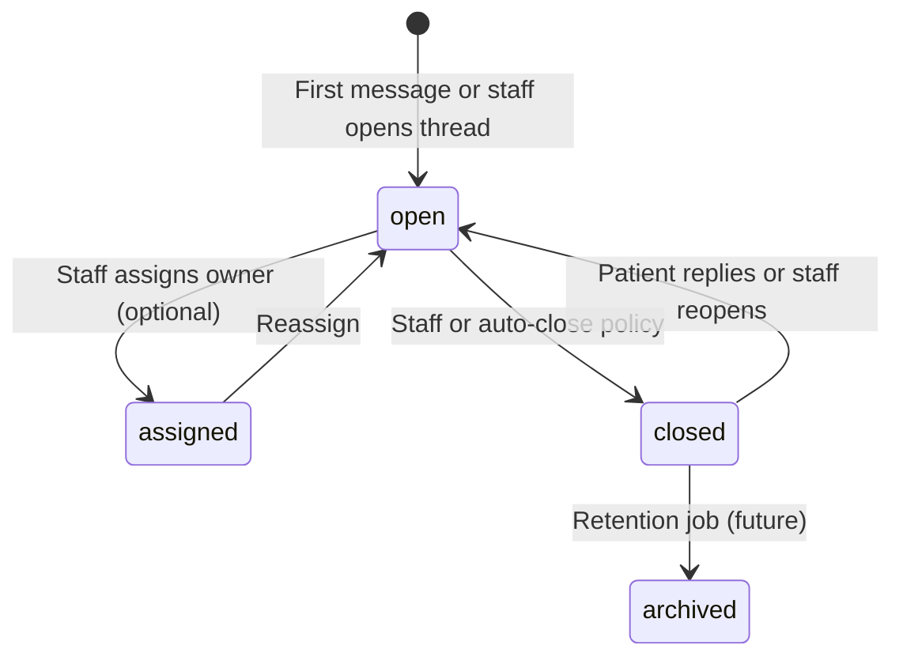
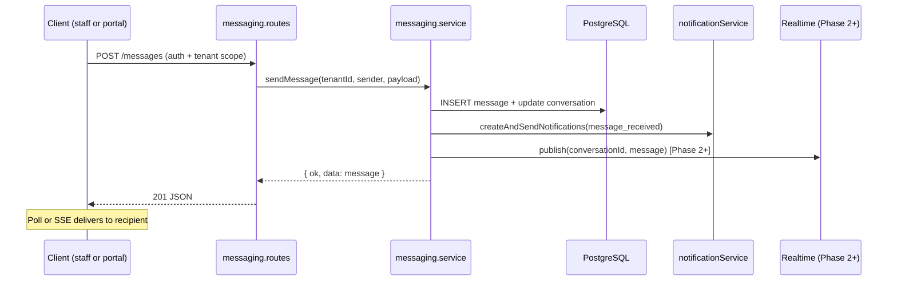

# Secure Real-Time Messaging — Comprehensive Plan

**Version:** 1.3.0  
**Status:** Phase 1–3 complete; rich text, SMS alerts, and offline messaging shipped June 2026  
**Last Updated:** June 2026  
**Related docs:** [PATIENT_PORTAL_PLAN.md](./PATIENT_PORTAL_PLAN.md) §6 Phase 4, [RBAC.md](./RBAC.md), [AUTH_SYSTEM.md](./AUTH_SYSTEM.md), [BACKEND_ARCHITECTURE.md](./BACKEND_ARCHITECTURE.md), [APPOINTMENT_NOTIFICATIONS.md](./APPOINTMENT_NOTIFICATIONS.md), [TELEHEALTH_PLAN.md](./TELEHEALTH_PLAN.md), [E_TICKETING_STAFF_PLAN.md](./E_TICKETING_STAFF_PLAN.md)

### Implementation notes (as built)

- **Migrations:** `migrations/20260614_01_messaging_foundation.sql`, `migrations/20260614_02_message_received_notification_type.sql`
- **Schema:** `shared/schema.ts` — `conversations`, `conversation_participants`, `messages`, `message_attachments`, `messaging_audit_log`
- **Shared types:** `shared/messaging.ts`
- **API (staff):** `server/modules/messaging/` — `/api/messaging/*` (`requireClinicalAccess`)
- **API (portal):** mounted on portal router — `/api/portal/messaging/*` (portal session + `features.messaging`)
- **Notifications:** `message_received` type; staff fallback recipients `medical_staff` + `admin` only (not EMT/safety officer)
- **Retention default:** 7 years (`MESSAGING_DEFAULT_RETENTION_YEARS`), stored on `conversations.retention_until`
- **Attachments (schema only):** PDF + images MIME allowlist in `shared/messaging.ts`; upload API deferred to Phase 3
- **Consent:** Portal first message requires acceptance; Terms §3a + `client/src/content/portalMessagingTerms.ts`
- **Client:** `/messages` (staff), `/portal/messages` (portal), Settings → Patient portal → **Secure messaging** toggle; header unread badge; Medical Visit embed (`PatientMessagingPanel`); appointments “Message patient” shortcut
- **Real-time:** SSE streams (`/api/messaging/stream`, `/api/portal/messaging/stream`) with React Query invalidation; HTTP polling is **fallback only** when SSE is disconnected (5s active / 30s inbox)
- **Staff internal (Phase 2):** `staff_internal` threads; Patients / Staff inbox tabs; `MessagingStaffInternalDialog`
- **Attachments (Phase 3):** `POST .../messages/:messageId/attachments` (PDF + images, Vercel Blob); up to **5 attachments per message**; composer multi-select
- **Context threads:** `GET /api/messaging/conversations/lookup?appointmentId|encounterId`; deep links from appointments, Medical Visit (encounter), telecare end screen
- **Thread export:** `GET .../conversations/:id/export?format=csv` (staff + portal); audit log `conversation.exported`; client **Print / Save as PDF**
- **Rich text (optional):** Composer **Plain text** (default) | **Rich text**; TinyMCE (`MessageRichTextEditor`); server sanitization in `server/shared/messagingHtml.ts` (`sanitizeMessagingHtml`); `body_html` + plain `body_text` for previews; tables, underline, lists, links supported; no images in HTML (use attachments)
- **SMS alerts:** `message_received` deliverable via notification preference channel **sms**; Twilio when `TWILIO_*` env vars set; PHI-safe template (title + link only, no message body); delivery logged in `notification_delivery_logs`
- **Offline messaging:** IndexedDB cache (inbox + threads + outbox) in `offlineStore` v3; `client/src/lib/offlineMessaging.ts`; read cached threads offline; queue send/create with optimistic UI + **Pending sync** badges; auto-flush outbox on reconnect (`syncMessagingOutbox` in `App.tsx`); attachments/delete/close require online

### Product / legal decisions (resolved)

| Question | Decision |
|----------|----------|
| Retention vs medical records | **7 years** default (occupational health / HIPAA-aligned best practice); stored per conversation |
| Safety officers / EMTs in patient threads | **No** — clinical staff + admin only (`requireClinicalAccess`) |
| Terms / consent copy | **Yes** — Terms §3a + portal composer consent on first thread |
| Attachment types | **PDF + images only** (JPEG, PNG, WebP, GIF); constants in `shared/messaging.ts` |

---

## Table of Contents

1. [Executive overview](#1-executive-overview)
2. [Goals and non-goals](#2-goals-and-non-goals)
3. [Scope and conversation types](#3-scope-and-conversation-types)
4. [Architecture](#4-architecture)
5. [Real-time delivery strategy](#5-real-time-delivery-strategy)
6. [Data model](#6-data-model)
7. [Security and compliance](#7-security-and-compliance)
8. [API surface (conceptual)](#8-api-surface-conceptual)
9. [UI placement](#9-ui-placement)
10. [Notifications integration](#10-notifications-integration)
11. [Integration with existing modules](#11-integration-with-existing-modules)
12. [Implementation phases](#12-implementation-phases)
13. [Risks and open decisions](#13-risks-and-open-decisions)

---

## 1. Executive overview

### Purpose

Add **secure, tenant-scoped messaging** inside MineAid HMS so that:

- **Patients** can exchange asynchronous messages with clinic staff through the **patient portal**.
- **Staff** can message patients (within clinical workflows) and each other (internal coordination).
- Messages are **auditable**, **PHI-aware**, and delivered with **near-real-time** UX without compromising the existing Express monolith patterns.

This plan fulfills the **Phase 4 — Engagement** item in [PATIENT_PORTAL_PLAN.md](./PATIENT_PORTAL_PLAN.md) (“Secure messaging”) and extends it to staff-side inbox and internal threads.

### Business value

- **Reduced phone/email volume** for routine questions (refills, appointment clarifications, follow-up instructions).
- **Continuity of care** — threaded context tied to patient, appointment, or encounter when relevant.
- **Audit trail** — who said what, when, with read receipts and retention policy.
- **Operational efficiency** — staff can triage and assign patient message queues without leaving HMS.

### Critical distinction from adjacent systems

| System | Purpose | Do not conflate |
|--------|---------|-----------------|
| **Notifications** (`notifications` table) | Alert/inbox rows; email/SMS delivery | Message **bodies** live in messaging tables; notifications only **alert** that a message arrived |
| **Telecare / LiveKit** | Synchronous A/V visits | Optional future in-call chat is separate; not MVP |
| **Staff e-ticketing** (`ticket_comments`) | Internal ops tickets | Patient-facing threads use messaging module |
| **Appointment emails** | One-way transactional comms | Not threaded; messaging is bidirectional |

---

## 2. Goals and non-goals

### Goals

1. **Tenant isolation** — Every conversation and message scoped by `tenant_id`; no cross-tenant visibility.
2. **Dual-audience auth** — Separate staff (`/api/messaging/*`) and portal (`/api/portal/messaging/*`) APIs, mirroring telecare’s split session model.
3. **PHI-safe by default** — Server-side authorization on every read/write; clinical threads require `requireClinicalAccess` on staff routes.
4. **Near-real-time UX** — Active threads update within seconds for the recipient (phased infra; see [§5](#5-real-time-delivery-strategy)).
5. **Auditability** — Immutable message records; optional soft-delete for UI only; full audit log for sensitive actions.
6. **Notification hooks** — New messages trigger existing notification pipeline (`createAndSendNotifications`) with user preferences — never hardcoded recipients.
7. **Extensibility** — Attachments, typing indicators, and WebSocket upgrade path without schema rewrite.

### Non-goals (initial phases)

- **Full chat replacement** for acute/emergency care — messaging is **non-urgent**; UI must communicate this.
- **SMS/WhatsApp as primary channel** — not the message transport; optional **alert** channel only (no PHI in SMS body).
- **End-to-end encryption (E2EE)** — Transport + at-rest security within tenant boundary; E2EE deferred (see [§13](#13-risks-and-open-decisions)).
- **Public/external messaging** — No messaging with unauthenticated third parties.
- **Replacing ticket comments** — Staff internal ops tickets stay in the e-ticketing module.

---

## 3. Scope and conversation types

### Conversation types (enum)

| Type | Participants | PHI | Staff roles |
|------|--------------|-----|-------------|
| `patient_staff` | One patient ↔ one or more staff | Yes | `medical_staff`, `admin` (+ assignees) |
| `staff_internal` | Staff ↔ staff (optionally location-scoped) | Usually no | All staff roles (configurable) |
| `encounter_thread` | Patient + staff, linked to `encounter_id` | Yes | Clinical roles only |
| `appointment_thread` | Patient + staff, linked to `appointment_id` | Yes | Clinical roles only |

**MVP:** `patient_staff` only. Add `staff_internal` in Phase 2; context-linked threads in Phase 3.

### Thread lifecycle



- **Open** — Active; patient and staff can send.
- **Closed** — Read-only for patient; staff may reopen.
- **Archived** — Hidden from default lists; admin/audit access only (future phase).

### Message content

- **MVP:** Plain text body (max length enforced server-side, e.g. 4,000 chars).
- **Phase 2:** Rich text (reuse ticket TinyMCE + sanitization pattern) or markdown subset.
- **Phase 3:** File attachments (reuse Blob/local storage pattern from tickets; MIME allowlist; virus scan hook placeholder).

---

## 4. Architecture

### Module layout (follow [BACKEND_ARCHITECTURE.md](./BACKEND_ARCHITECTURE.md))

```
server/modules/messaging/
  messaging.routes.ts           # Staff: /api/messaging/*
  messaging.controller.ts
  messaging.service.ts            # Business rules, notification triggers
  messaging.repository.ts         # Drizzle queries
  messaging-realtime.service.ts   # Phase 2+: SSE fan-out / pub-sub adapter
  portal-messaging.routes.ts      # Portal: /api/portal/messaging/* (or nested in portal.routes.ts)

client/src/components/messaging/
  MessagingInbox.tsx              # Staff inbox + thread list
  MessagingThread.tsx               # Active conversation
  MessagingComposer.tsx
  PatientMessagingPanel.tsx       # Embed on Medical Visit / patient chart
  useMessagingThread.ts           # React Query + realtime subscription hook

client/src/portal/
  PortalMessagesPage.tsx          # Portal inbox
  PortalMessageThread.tsx

shared/messaging.ts               # Types, enums, Zod schemas shared client/server
migrations/YYYYMMDD_messaging_foundation.sql
```

### Request flow



### Multi-tenant and identity

- **Staff sender:** `users.id` from `req.user`; tenant from `req.user.tenantId`.
- **Portal sender:** `portal_users.id` + `patient_id` from `req.portal`; never accept `patient_id` from request body.
- **Participants table** uses polymorphic identity:
  - `participant_type`: `staff` | `portal`
  - `staff_user_id` OR `portal_user_id` (exactly one set)
- All queries filter `tenant_id` **and** verify caller is a participant (or admin triage role where allowed).

### Realtime infrastructure note

Today the app has **no application WebSocket or SSE layer** — “live” behavior uses React Query polling (telecare: 10s in-call, 30s queue). Messaging MVP aligns with that pattern; dedicated realtime is Phase 2 (see [§5](#5-real-time-delivery-strategy)).

---

## 5. Real-time delivery strategy

Phased approach to avoid over-engineering before product validation.

### Phase 1 — Smart polling (MVP)

| Surface | Behavior |
|---------|----------|
| Active thread open | Poll `GET .../messages?since=<cursor>` every **3–5s** |
| Inbox / unread badge | Poll every **15–30s**; invalidate on window focus |
| After send | Optimistic UI + immediate invalidation |

**Pros:** Zero new server infra; matches telecare patterns; works on Railway as-is.  
**Cons:** Latency up to poll interval; higher DB read load at scale.

### Phase 2 — Server-Sent Events (SSE)

- Single authenticated SSE endpoint per audience:
  - `GET /api/messaging/stream` (staff)
  - `GET /api/portal/messaging/stream` (portal)
- Server publishes events: `message.new`, `message.read`, `conversation.updated`.
- Connection scoped to tenant + user; heartbeat every 30s.
- Fallback to Phase 1 polling if SSE disconnects.

**Pros:** Simple on Express; one-way push sufficient for messaging; HTTP-friendly on Railway.  
**Cons:** One connection per tab; no binary attachment streaming over SSE.

### Phase 3 — WebSocket (optional)

- Upgrade `http.createServer` or separate lightweight WS service.
- Needed only if: typing indicators at scale, multi-tab sync requirements, or bidirectional binary.
- Evaluate **after** SSE soak period.

### Client hook contract

```ts
// shared/messaging.ts — conceptual
type MessagingRealtimeEvent =
  | { type: "message.new"; conversationId: string; message: MessageDto }
  | { type: "message.read"; conversationId: string; messageId: string; readAt: string }
  | { type: "conversation.updated"; conversation: ConversationDto };

// useMessagingThread(conversationId) — abstracts poll vs SSE
```

---

## 6. Data model

### Tables (new)

All tables include `created_at`, `updated_at`, UUID PKs, and `tenant_id` FK — consistent with [shared/schema.ts](../shared/schema.ts) conventions.

#### `conversations`

| Column | Type | Notes |
|--------|------|-------|
| `id` | UUID PK | |
| `tenant_id` | UUID FK → tenants | Required |
| `type` | enum | `patient_staff`, `staff_internal`, `encounter_thread`, `appointment_thread` |
| `subject` | varchar(255) | Optional display title |
| `patient_id` | UUID FK → patients | Required for patient-facing types |
| `encounter_id` | UUID FK → encounters | Nullable; set for `encounter_thread` |
| `appointment_id` | UUID FK → appointments | Nullable |
| `status` | enum | `open`, `closed`, `archived` |
| `assigned_staff_user_id` | UUID FK → users | Nullable triage owner |
| `last_message_at` | timestamp | Denormalized for inbox sort |
| `last_message_preview` | varchar(200) | Truncated plaintext; no HTML in MVP |
| `created_by_type` | enum | `staff` \| `portal` |
| `created_by_staff_user_id` | UUID | Nullable |
| `created_by_portal_user_id` | UUID | Nullable |

**Indexes:** `(tenant_id, last_message_at DESC)`, `(tenant_id, patient_id)`, `(tenant_id, status)`.

#### `conversation_participants`

| Column | Type | Notes |
|--------|------|-------|
| `id` | UUID PK | |
| `tenant_id` | UUID FK | |
| `conversation_id` | UUID FK | |
| `participant_type` | enum | `staff` \| `portal` |
| `staff_user_id` | UUID FK → users | Nullable |
| `portal_user_id` | UUID FK → portal_users | Nullable |
| `joined_at` | timestamp | |
| `left_at` | timestamp | Nullable |
| `last_read_at` | timestamp | Per-participant read cursor |
| `notifications_muted` | boolean | Default false |

**Unique:** `(conversation_id, staff_user_id)` where staff; `(conversation_id, portal_user_id)` where portal.

#### `messages`

| Column | Type | Notes |
|--------|------|-------|
| `id` | UUID PK | |
| `tenant_id` | UUID FK | |
| `conversation_id` | UUID FK | |
| `sender_type` | enum | `staff` \| `portal` \| `system` |
| `sender_staff_user_id` | UUID | Nullable |
| `sender_portal_user_id` | UUID | Nullable |
| `body_text` | text | Plaintext MVP |
| `body_html` | text | Nullable; Phase 2 rich text |
| `deleted_at` | timestamp | Soft delete; content retained for audit |
| `edited_at` | timestamp | Nullable; Phase 2 |
| `client_message_id` | varchar(64) | Idempotency key from client |

**Indexes:** `(conversation_id, created_at)`, `(tenant_id, conversation_id, created_at)`.

**Immutability:** No hard DELETE in application code; audit retention policy applies.

#### `message_attachments` (Phase 3)

| Column | Type | Notes |
|--------|------|-------|
| `id`, `tenant_id`, `message_id` | | |
| `file_url`, `original_name`, `mime_type`, `size_bytes` | | Mirror `ticket_attachments` |
| `uploaded_by_*` | | Staff or portal polymorphic |

#### `messaging_audit_log`

| Column | Type | Notes |
|--------|------|-------|
| `id`, `tenant_id`, `actor_*`, `action`, `conversation_id`, `message_id`, `metadata_json`, `created_at` | | e.g. `thread.opened`, `thread.closed`, `message.sent`, `message.read` |

### Notification type seed

Add row to `notification_types`:

- `key`: `message_received`
- Channels: `in_app`, `email` (respect `user_notification_preferences`)

Portal users do **not** use staff `notifications` table in MVP — portal alerts via **email only** until portal notification inbox exists (Phase 2+).

### Drizzle / shared types

- Enums and tables in `shared/schema.ts`
- `shared/messaging.ts` — DTOs, cursor pagination types, realtime event unions
- Zod insert schemas for API validation

---

## 7. Security and compliance

### Authorization matrix

| Action | Portal patient | Staff (clinical) | Staff (non-clinical) | Admin |
|--------|----------------|------------------|----------------------|-------|
| List own patient threads | Yes | — | — | — |
| List clinic patient queue | — | Yes | No | Yes |
| Send in patient thread | Yes (own) | Yes | No | Yes |
| Staff internal thread | — | Phase 2 | Phase 2 | Yes |
| View message body (PHI) | Own threads only | Yes (`requireClinicalAccess`) | No | Yes |
| Assign / close thread | — | Yes | No | Yes |
| Export / audit log | — | Limited | No | Yes |

Apply **`requireClinicalAccess`** on all staff routes that return patient-identifiable thread content ([RBAC.md](./RBAC.md)).

### Transport and storage

- **HTTPS only** in production (existing Railway setup).
- **HttpOnly session cookies** — staff `sessionToken`, portal `portalSessionToken`; never mix on same endpoint.
- **At rest:** PostgreSQL on Neon (encrypted storage); no message bodies in application logs.
- **Input validation:** Max body length; rich HTML sanitized server-side via `sanitizeMessagingHtml` (allowlist tags; TinyMCE styled spans normalized to semantic tags; tables allowed without inline styles).
- **Rate limiting:** Per-IP and per-user limits on send endpoints (align with portal login limits in [PATIENT_PORTAL_PLAN.md](./PATIENT_PORTAL_PLAN.md) §9).

### Email and external channels

- **Never include PHI in email bodies** — subject/body: “You have a new message in the patient portal” + link to `/portal/messages`.
- Staff email alerts: link to `/messages` or deep link to thread.
- SMS/WhatsApp: **alert only** when user enables channel in notification preferences; same no-PHI rule as email. SMS via Twilio (`TWILIO_ACCOUNT_SID`, `TWILIO_AUTH_TOKEN`, `TWILIO_PHONE_NUMBER`); staff user must have `phone_number` on file.

### Audit and retention

- Log: thread create/close, message send, read receipts (aggregate), assignment changes.
- **Retention:** Tenant-configurable (default: align with medical record retention policy — TBD with legal).
- **Legal hold:** Do not purge messages under hold (future admin flag).

### Threat model (summary)

| Threat | Mitigation |
|--------|------------|
| Cross-tenant access | `tenant_id` on every query; session-derived tenant only |
| Patient A reads Patient B | Portal APIs filter by session `patient_id` |
| IDOR on conversationId | Participant membership check before any read/write |
| XSS in message body | Server-side `sanitizeMessagingHtml` before persist; render stored HTML only; no inline `style`/`script` |
| Spam / abuse | Rate limits; staff can close thread; optional block list (future) |
| Session hijack | Existing session security ([SESSION_SECURITY_AND_MFA.md](./SESSION_SECURITY_AND_MFA.md)) |

---

## 8. API surface (conceptual)

### Staff (`authMiddleware` + clinical gate where noted)

| Method | Path | Description |
|--------|------|-------------|
| GET | `/api/messaging/conversations` | Inbox; filters: `status`, `assignedToMe`, `patientId`, cursor |
| POST | `/api/messaging/conversations` | Open thread with patient (clinical) |
| GET | `/api/messaging/conversations/:id` | Thread metadata + participants |
| PATCH | `/api/messaging/conversations/:id` | Assign, close, reopen |
| GET | `/api/messaging/conversations/:id/messages` | Paginated history; `?since=` for poll |
| POST | `/api/messaging/conversations/:id/messages` | Send message; `clientMessageId` for idempotency |
| POST | `/api/messaging/conversations/:id/read` | Mark read up to message id |
| GET | `/api/messaging/unread-count` | Badge count |
| GET | `/api/messaging/stream` | SSE (Phase 2) |

### Portal (`requirePortalAuth`)

| Method | Path | Description |
|--------|------|-------------|
| GET | `/api/portal/messaging/conversations` | Patient’s threads |
| POST | `/api/portal/messaging/conversations` | Start thread (subject + first message) |
| GET | `/api/portal/messaging/conversations/:id/messages` | History |
| POST | `/api/portal/messaging/conversations/:id/messages` | Reply |
| POST | `/api/portal/messaging/conversations/:id/read` | Mark read |
| GET | `/api/portal/messaging/unread-count` | Badge |
| GET | `/api/portal/messaging/stream` | SSE (Phase 2) |

### Response conventions

- Follow existing `{ ok, data }` / `sendError` patterns.
- Cursor pagination: `{ items, nextCursor, hasMore }`.
- Include `participantDisplayNames` resolved server-side (no client-side patient ID guessing).

---

## 9. UI placement

### Staff HMS

| Location | Purpose |
|----------|---------|
| **Sidebar → Messages** (`/messages`) | Primary inbox; filter assigned / unassigned / all |
| **Patient chart / Medical Visit** | Embedded `PatientMessagingPanel` — threads for current patient |
| **Appointments row** | “Message patient” shortcut — opens or creates `appointment_thread` (Phase 3) |
| **Header badge** | Unread count (extend `MainLayout` pattern used for notifications) |

### Patient portal

| Location | Purpose |
|----------|---------|
| **Portal nav → Messages** (`/portal/messages`) | Full inbox |
| **Portal home** | Unread indicator + “Contact clinic” CTA |
| **Post-appointment / telehealth** | Optional “Send a follow-up message” link (Phase 3) |

### UX requirements

- **Non-urgent disclaimer** on composer: “For emergencies, call …” (tenant `support_phone` from portal settings).
- **Read receipts** — show “Seen” when `last_read_at` ≥ message time (portal ↔ staff).
- **Empty states** — guided first message from portal; staff empty queue messaging.
- **Mobile-friendly** — portal priority; staff usable on tablet.

---

## 10. Notifications integration

Per [.cursorrules](../.cursorrules) and [APPOINTMENT_NOTIFICATIONS.md](./APPOINTMENT_NOTIFICATIONS.md):

```
messaging.service.sendMessage()
  → messaging.repository.insertMessage()
  → resolveRecipients(conversation, excludeSender)
  → notificationTriggers / createAndSendNotifications({
       notificationTypeKey: "message_received",
       tenantId,
       recipients: [...],  // from preferences, never hardcoded
       context: { conversationId, deepLink }
     })
  → (Phase 2) messaging-realtime.service.publish()
```

- **Staff recipients:** Rows in `notifications` + optional email per `user_notification_preferences`.
- **Portal recipients (MVP):** Email to portal account email only; deep link to thread.
- **Do not** store chat bodies in `notifications.message` — use generic alert text + link.

---

## 11. Integration with existing modules

| Module | Integration |
|--------|-------------|
| **Patient portal** | Implements [PATIENT_PORTAL_PLAN.md](./PATIENT_PORTAL_PLAN.md) Phase 4 messaging; replaces conceptual `portal_messages` table with normalized schema above |
| **Encounters / Medical Visit** | Phase 3: auto-create or link `encounter_thread` when opening visit; deep link from encounter header |
| **Appointments** | Phase 3: `appointment_thread`; optional nudge after telehealth session ends |
| **Telecare** | No in-call chat in MVP; post-visit messaging link only; LiveKit data channels explicitly out of scope |
| **E-ticketing** | Separate; optional staff note “escalated to ticket #123” as system message (future) |
| **Tenant settings** | Feature flag: `tenant_portal_settings.features_json.messagingEnabled` |
| **Offline / sync** | [OFFLINE_MODE_AND_SYNC.md](./OFFLINE_MODE_AND_SYNC.md) — messaging inbox/thread cache + outbox (staff + portal); sync on reconnect |

---

## 12. Implementation phases

### Phase 1 — MVP (patient ↔ staff, polling)

**Deliverables**

- [x] Migration: `conversations`, `conversation_participants`, `messages`, `messaging_audit_log`
- [x] `notification_types` seed: `message_received`
- [x] Server module: CRUD + send + read + unread count
- [x] Portal UI: inbox + thread + composer
- [x] Staff UI: inbox + patient panel embed
- [x] React Query polling (5s active / 30s inbox)
- [x] Email alerts (no PHI in body)
- [x] Tenant feature flag in portal settings
- [x] Basic rate limiting on send endpoints

**Exit criteria:** Patient can message clinic; clinical staff can reply; unread badges update within poll interval; audit log populated.

### Phase 2 — Realtime + staff internal

**Deliverables**

- [x] SSE stream endpoints + client hook upgrade
- [x] `staff_internal` conversation type + staff-only inbox filter
- [x] Rich text composer (optional; sanitized HTML — `messagingHtml.ts`, `MessageRichTextEditor`)
- [x] Portal in-app notification row (`portal_notifications` table + header bell)
- [x] Soft delete (sender, 5 min window) + read receipts (“Seen”)
- [x] SSE client reconnect with exponential backoff
- [x] Emergency disclaimer with tenant `contactPhone` on portal composer
- [x] Assignment workflow + “my queue” filters

### Phase 3 — Context links + attachments

**Deliverables**

- [x] `encounter_thread`, `appointment_thread` auto-link helpers
- [x] `message_attachments` + upload API (Blob-aligned)
- [x] Deep links from appointments, encounters, telecare session end screen
- [x] Thread export for compliance (PDF/CSV admin tool)

### Phase 4 — Scale and polish

**Deliverables**

- [ ] WebSocket evaluation / migration if SSE insufficient
- [ ] Typing indicators (requires Phase 4 transport)
- [ ] Tenant retention automation + legal hold
- [ ] Analytics: response time, volume per location
- [x] SMS channel for “new message” alert (via notification channels + Twilio)
- [x] Offline read + queued send (IndexedDB outbox; see OFFLINE_MODE_AND_SYNC.md §11)

---

## 13. Risks and open decisions

| Item | Options | Recommendation |
|------|---------|----------------|
| **Portal notification inbox** | Email-only MVP vs new `portal_notifications` table | **Implemented:** `portal_notifications` + email; no PHI in notification body |
| **Who can see unassigned patient queue?** | All clinical staff vs location-scoped vs assigned panel | Tenant setting; default all `medical_staff` at tenant |
| **Patient can start thread vs staff-only** | Portal creates thread vs request-only | Allow portal create with optional staff approval mode (tenant flag) |
| **E2EE** | Client-side encryption vs platform trust | Defer; document that messages are encrypted in transit/at rest but readable by authorized clinic staff |
| **Message edit/delete** | Immutable vs soft delete | **Implemented:** Soft delete for sender within 5 min; audit retains original |
| **After-hours auto-reply** | System message on send outside hours | Phase 2; uses `sender_type: system` |
| **DB load from polling** | Indexes + `since` cursor vs materialized views | Proper indexes on `(conversation_id, created_at)`; monitor Neon metrics |
| **Railway SSE timeouts** | Proxy idle timeout | Heartbeats + client reconnect with `Last-Event-ID` |

### Open questions for product/legal

**Resolved (June 14, 2026):**

1. **Retention** — 7 years default, aligned with medical record retention (`MESSAGING_DEFAULT_RETENTION_YEARS`).
2. **Safety officers / EMTs** — excluded from patient threads; staff API uses `requireClinicalAccess`.
3. **Terms / consent** — Terms §3a + portal consent block on first message.
4. **Attachments** — PDF and images only when Phase 3 upload ships.

---

## Appendix A — Reference implementations in codebase

| Pattern | Location |
|---------|----------|
| Dual staff/portal API | `server/modules/telecare/`, `server/modules/portal/portal.routes.ts` |
| Threaded comments | `server/modules/tickets/`, `ticket_comments` in schema |
| Notification trigger | `server/notificationService.ts`, `server/notificationTriggers.ts` |
| Polling hook | `client/src/components/telecare/useTelecareRoom.ts` |
| Clinical auth gate | `server/shared/middleware/clinicalAuth.ts` |
| File uploads | `server/modules/tickets/` attachments → Vercel Blob |
| Rich text sanitize | `server/shared/messagingHtml.ts`, `server/modules/messaging/messaging-body.ts` |
| Messaging offline | `client/src/lib/offlineMessaging.ts`, `client/src/types/offlineMessaging.ts` |
| SMS delivery | `server/notificationService.ts` (`sendSMS`, `createAndSendNotifications` sms branch) |

---

## Appendix B — Environment variables (Phase 2+)

No new secrets required for MVP. Optional tuning:

```env
# Messaging (optional overrides)
MESSAGING_POLL_INTERVAL_MS=5000
MESSAGING_INBOX_POLL_INTERVAL_MS=30000
MESSAGING_MAX_BODY_LENGTH=4000
MESSAGING_SSE_HEARTBEAT_MS=30000

# SMS alerts (optional — message_received channel)
TWILIO_ACCOUNT_SID=
TWILIO_AUTH_TOKEN=
TWILIO_PHONE_NUMBER=
```

---

*This document is the authoritative plan for the messaging module until implementation notes are added at the top (as in [E_TICKETING_STAFF_PLAN.md](./E_TICKETING_STAFF_PLAN.md)).*
