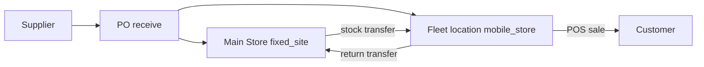
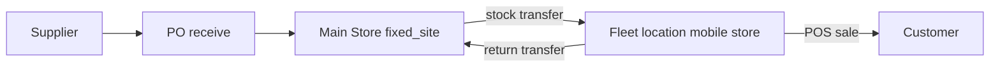

# Mobile stores, fleet vehicles, and inventory

**Product:** uventorybiz  
**Last updated:** July 19, 2026  
**Related:** [BUSINESS_ASSETS_MANAGEMENT.md](./BUSINESS_ASSETS_MANAGEMENT.md), [AMBULANCE_MANAGEMENT_AND_INVENTORY_PLAN.md](./AMBULANCE_MANAGEMENT_AND_INVENTORY_PLAN.md), [INVENTORY_TRANSFERS_AND_ISSUES_PLAN.md](./INVENTORY_TRANSFERS_AND_ISSUES_PLAN.md)

This note clarifies how **brick-and-mortar stores**, **commute fleet**, and **mobile stores** share one inventory location model — and how Business Assets relates to Fleet.

---

## 1. Mental model

| Concept | What it is in the system |
|---|---|
| Brick-and-mortar store / warehouse | `care_locations` with `location_kind = fixed_site` |
| Any fleet vehicle (van, truck, unit) | Business asset `asset_type = vehicle` **plus** a 1:1 `care_locations` row with `location_kind = fleet` |
| On-board / mobile-store stock | `inventory_stock` rows at that fleet location id |
| “Belongs to Main Store” | `care_locations.stationed_at_location_id` → a fixed site (home base). Not the same as non-vehicle `assigned_location_id`. |
| Vehicle kind | `commute` (transport / little stock) vs `mobile_store` (extension of the shop that holds sellable stock) |

There is **one** inventory engine. Mobile stores are not a separate stock system — they are fleet locations that receive transfers (and may receive POs / run POS).

```
Business asset (vehicle)
        │
        └── stock_location_id ──► care_locations (location_kind=fleet)
                                      │
                                      ├── inventory_stock / transfers / optional POS register
                                      └── stationed_at_location_id → Main Store (fixed_site)
```

---

## 2. Why Assets form historically hid “location”

Non-vehicle assets use **`assigned_location_id`** (“where is this equipment stationed?”).

Vehicles **are** a stock site. Putting them on `assigned_location_id` would fight the fleet model. Instead:

- Identity / tag → `business_assets`
- Stock key → `stock_location_id` (fleet `care_locations` id)
- Home base → **`stationed_at`** on the linked fleet location (also editable from Assets for vehicles)

---

## 3. What is already supported

| Flow | Supported? |
|---|---|
| Stock transfer store ↔ vehicle | Yes — same `stock_transfers` as store ↔ store |
| Inventory filtered to fleet (`fleetOnly`) | Yes |
| Fleet unit detail: on-board stock, transfers, receive | Yes |
| PO receive into a fleet / mobile-store location | Yes (allowed; vehicle may collect from supplier) |
| POS sale from a van | Yes if a POS register is bound to that fleet `locationId` |
| Commute vs mobile store classification | Yes — `vehicle_kind` on the asset |

---

## 4. Mobile-store operating flows

### Setup (once)

1. Ensure Main Store (fixed site, often primary) exists.
2. Create the vehicle as a Business Asset (or via Fleet) → asset tag + fleet stock location.
3. Set **Vehicle kind** = `mobile_store` (vs `commute`).
4. Set **Stationed at** = Main Store (or the depot that owns the unit).
5. Optional: create a POS register on that fleet location for van sales.

### Day operations

1. Pre-start / ops status (`available`, `deployed`, `standby`, `out_of_service`).
2. Stock lives at the fleet location; stationed-at is organizational (home base), not stock math.
3. Work from Fleet unit detail or Inventory with fleet filter.

### Stocking (warehouse → van)

1. Supplier PO → receive into Main Store **or** directly into the fleet location if the vehicle collects goods.
2. Or **Stock transfer**: Main Store → fleet location (dispatch + receive).
3. On-board qty = `inventory_stock` at the vehicle’s `stock_location_id`.
4. Returns / end-of-day: transfer leftover stock back to Main Store, or leave it on the van.

### Sales (van → customer)

1. Open POS on the register tied to that fleet location.
2. Search/sell draws down stock at that location.
3. Optional: transfer remaining stock home after the run.



### Commute vehicles

Same asset/fleet machinery, but **Vehicle kind** = `commute`. They may hold little or no sellable stock; transfers and POS are still possible if you choose to use them that way.

---

## 5. Practical rules of thumb

1. **Tag / tickets / register** → Business Assets (`/assets`).
2. **Pre-start, on-board board, ops status** → Fleet (`/assets/fleet/*` or `/fleets/*`).
3. **Qty movements** → Inventory + Stock transfers (and PO receive / POS) using the fleet location id.
4. **Home base** → Stationed at (fixed site).
5. **Mobile shop vs staff car** → Vehicle kind.

---

## 6. Gaps this design intentionally leaves open

- No separate inventory tables for “mobile commerce.”
- Vehicle kind does not automatically create a POS register — that remains an ops setup step.
- Stationed-at does not move stock when the home base changes; only metadata changes.


# Ignore (But dont delete) - Just a copy/paste of the original response - I'll delete manually
<!-- 
Yes — the inventory side is built for that dynamic. What’s missing is mostly **UX/clarity on the Assets form**, not the stock model.

### What’s already correct

```
Business asset (vehicle)
        │
        └── stock_location_id ──► care_locations (location_kind=fleet)
                                      │
                                      ├── inventory_stock rows live here
                                      ├── stock transfers from/to here
                                      └── optional stationed_at_location_id → Main Store / warehouse
```

- **Brick-and-mortar** = `care_locations` with `location_kind=fixed_site`
- **Mobile store / any fleet unit** = same table, `location_kind=fleet`, and is a first-class inventory location
- Creating a vehicle asset provisions that fleet location (or fleet create ensures the vehicle asset)
- Transfers use `from_location_id` / `to_location_id` with **no “fleet blocked” rule** — store ↔ vehicle works like store ↔ store
- Fleet unit detail explicitly treats the unit as a location and links into Stock transfers

**Home base / “assigned to main warehouse”** is `stationedAtLocationId` on the **fleet location**, not `assignedLocationId` on the asset. That’s editable on **Fleet** create/edit (`FleetDialogs`), not on the Assets add/edit form — which is why the Assets form felt incomplete.

There is **no separate type** for “commute van” vs “mobile store.” Both are `asset_type=vehicle`. The difference is usage: commute vans may hold little/no stock; mobile stores get stocked and optionally a POS register on that fleet location.

### Deliberate constraints

| Flow | Fleet / mobile store allowed? |
|---|---|
| Stock transfer store → vehicle / vehicle → store | Yes |
| Inventory view filtered to fleet (`fleetOnly`) | Yes |
| PO receive **directly** onto vehicle | **No** — must receive into a fixed store, then transfer |
| POS sale from vehicle | Yes **if** a POS register is created with that fleet `locationId` |

---

### Mobile-store flows (as the system supports today)

**1. Setup (once)**  
1. Ensure Main Store (fixed site, often primary) exists.  
2. Create vehicle as Business Asset **or** Fleet unit → gets tag + fleet stock location.  
3. On Fleet edit, set **Stationed at** = Main Store (home base metadata).  
4. Optional: create POS register bound to that fleet location for roadside/van sales.

**2. Operation (day)**  
1. Pre-start / ops status on the vehicle (`available` / `deployed` / etc.).  
2. Unit is “at” its fleet location for stock; stationed-at is organizational, not stock math.  
3. Work from Fleet unit detail (on-board stock, transfers tab) or Inventory with fleet filter.

**3. Stocking (warehouse → van)**  
1. Supplier PO → **receive into Main Store** (not fleet).  
2. **Stock transfer**: Main Store → fleet location; dispatch + receive (can receive from unit Transfers tab).  
3. On-board qty is `inventory_stock` at the vehicle’s `stock_location_id`.  
4. Top-ups / returns: same transfer pattern the other way.

**4. Sales (van → customer)**  
1. Open POS on the register tied to that fleet location.  
2. Search/sell draws down stock **at that location**.  
3. End of day: optional transfer leftover stock back to Main Store; or leave it on the van.



---

### Gaps vs your mental model

| Expectation | Status |
|---|---|
| Onboard stock is a location for transfers | Covered |
| May belong under a primary store | Covered as **stationed at** on Fleet, not Assets form |
| Assets form sets location / home base | Not on Assets UI today |
| Explicit “mobile store” vs “commute” asset kinds | Not modeled — same vehicle type |
| Sell from van | Works if POS register → fleet location |

So your read is right for **inventory and transfers**. The Assets form omitting location is intentional for `assignedLocationId`, but it doesn’t surface **stationed at**, which is the “belongs to Main Store” field you care about. If you want that on Assets add/edit (and/or a mobile-store flag), switch to Agent mode and we can wire it. -->