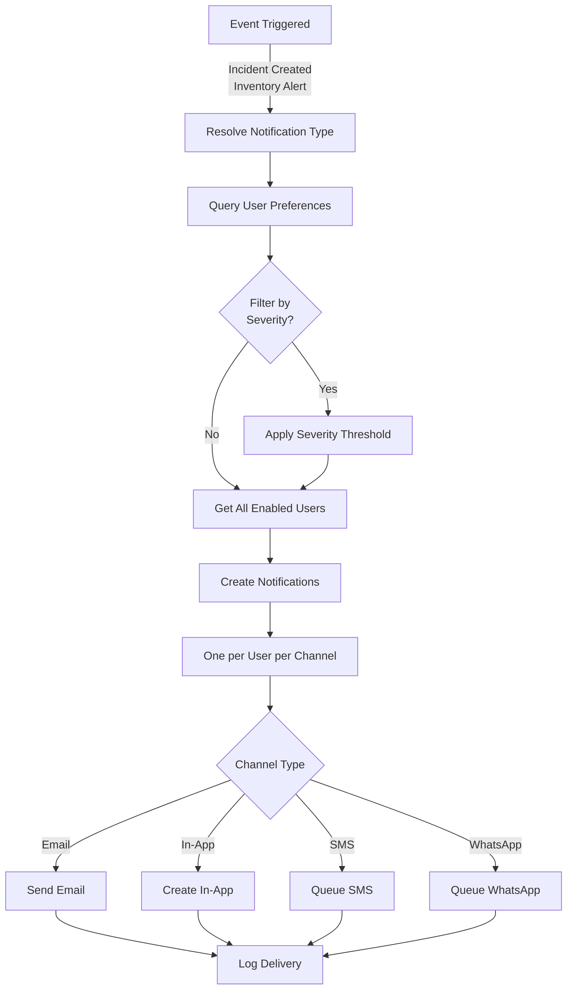

# Notification System Implementation Plan
## MineAid HMS - Automated Incident & Inventory Alert Notifications

**Version**: 1.0.0  
**Status**: ✅ Implemented  
**Last Updated**: January 2025

---

## Table of Contents

1. [Overview](#overview)
2. [Architecture](#architecture)
3. [Database Schema](#database-schema)
4. [Implementation Phases](#implementation-phases)
5. [API Design](#api-design)
6. [Admin UI Design](#admin-ui-design)
7. [Email Templates](#email-templates)
8. [Integration Points](#integration-points)
9. [Testing Strategy](#testing-strategy)
10. [Migration Guide](#migration-guide)

---

## Overview

This document outlines the implementation plan for a production-ready, data-driven notification system that enables automated incident and inventory alert notifications to preselected users. The system uses a row-based preference model that allows adding new alert types and channels without schema migrations.

### Key Features

- **Data-Driven Notification Types**: No schema changes when adding new alert types
- **Multi-Channel Support**: Email, in-app, SMS, WhatsApp (extensible)
- **Admin Configuration UI**: Manage alert recipients by role or individual users
- **Severity-Based Filtering**: Users receive alerts based on severity thresholds
- **Tenant Isolation**: Complete separation of notification preferences per tenant
- **Audit Trail**: Full delivery logging for compliance

### Business Value

- **Major Selling Point**: Automated alerts reduce response time for critical incidents
- **Compliance**: Ensures safety officers are notified of incidents per regulations
- **Inventory Management**: Prevents stockouts and expiry issues
- **Scalability**: Add new alert types without code deployments

---

## Architecture

### System Flow



### Core Principles

1. **Row-Based Preferences**: One row per (tenant, user, notification_type, channel)
2. **Data-Driven Types**: Notification types stored in database, not enums
3. **Separation of Concerns**: 
   - `notification_types`: What can generate notifications
   - `user_notification_preferences`: Who receives what
   - `notifications`: Delivery/audit records
   - `notification_delivery_logs`: Low-level delivery tracking
4. **No Schema Changes**: Adding channels or types = INSERT rows, not ALTER TABLE

---

## Database Schema

### 1. notification_types

Defines what can generate notifications. System-defined types seeded on migration.

```sql
CREATE TABLE notification_types (
  id VARCHAR PRIMARY KEY DEFAULT gen_random_uuid(),
  
  -- Stable machine key used in code & events (lowercase, snake_case)
  key VARCHAR NOT NULL UNIQUE,
  -- Examples: 'incident_created', 'inventory_low_stock', 'equipment_failure'
  
  category VARCHAR NOT NULL,
  -- 'incident' | 'inventory' | 'equipment' | 'system'
  
  display_name VARCHAR NOT NULL,
  -- Human-readable: 'Incident Created', 'Low Stock Alert'
  
  description TEXT,
  
  -- Optional flags
  severity_supported BOOLEAN DEFAULT FALSE,
  -- TRUE if alert type has severity (incidents, inventory alerts)
  
  system_defined BOOLEAN DEFAULT TRUE,
  -- TRUE = core system types, FALSE = custom tenant types
  
  created_at TIMESTAMP DEFAULT NOW(),
  updated_at TIMESTAMP DEFAULT NOW()
);

CREATE INDEX idx_notification_types_key ON notification_types(key);
CREATE INDEX idx_notification_types_category ON notification_types(category);
```

**Initial Seed Data**:

```sql
INSERT INTO notification_types (key, category, display_name, description, severity_supported) VALUES
  ('incident_created', 'incident', 'Incident Created', 'Notification when a new incident is reported', TRUE),
  ('incident_updated', 'incident', 'Incident Updated', 'Notification when an incident is updated', TRUE),
  ('inventory_low_stock', 'inventory', 'Low Stock Alert', 'Notification when inventory falls below minimum', TRUE),
  ('inventory_expiry', 'inventory', 'Expiry Alert', 'Notification when inventory is approaching expiry', TRUE),
  ('equipment_maintenance', 'equipment', 'Equipment Maintenance', 'Notification for scheduled equipment maintenance', FALSE),
  ('equipment_failure', 'equipment', 'Equipment Failure', 'Notification when equipment fails', TRUE),
  ('appointment_reminder', 'system', 'Appointment Reminder', 'Reminder for upcoming appointments', FALSE),
  ('registration_request', 'system', 'Registration Request', 'Admin notification for new user registrations', FALSE),
  ('status_change', 'system', 'Status Change', 'User account status changes', FALSE),
  ('password_reset', 'system', 'Password Reset', 'Password reset requests', FALSE)
ON CONFLICT (key) DO NOTHING;
```

### 2. user_notification_preferences

Row-based model: one row per (tenant, user, notification_type, channel).

```sql
CREATE TABLE user_notification_preferences (
  id VARCHAR PRIMARY KEY DEFAULT gen_random_uuid(),
  
  tenant_id VARCHAR NOT NULL REFERENCES tenants(id) ON DELETE CASCADE,
  user_id VARCHAR NOT NULL REFERENCES users(id) ON DELETE CASCADE,
  notification_type_id VARCHAR NOT NULL REFERENCES notification_types(id) ON DELETE CASCADE,
  
  -- Delivery channel (data, not boolean column)
  channel VARCHAR NOT NULL CHECK (channel IN ('email', 'in_app', 'sms', 'whatsapp')),
  
  enabled BOOLEAN NOT NULL DEFAULT TRUE,
  
  -- Optional severity filtering (NULL = no filter, applies to all severities)
  -- Only used if notification_type.severity_supported = TRUE
  min_severity VARCHAR NULL CHECK (min_severity IN ('low', 'medium', 'high', 'critical')),
  
  -- Admin override: if TRUE, user cannot change this preference
  admin_managed BOOLEAN NOT NULL DEFAULT FALSE,
  
  created_at TIMESTAMP DEFAULT NOW(),
  updated_at TIMESTAMP DEFAULT NOW(),
  
  UNIQUE (tenant_id, user_id, notification_type_id, channel)
);

CREATE INDEX idx_unp_tenant ON user_notification_preferences(tenant_id);
CREATE INDEX idx_unp_user ON user_notification_preferences(user_id);
CREATE INDEX idx_unp_notification_type ON user_notification_preferences(notification_type_id);
CREATE INDEX idx_unp_channel ON user_notification_preferences(channel);
CREATE INDEX idx_unp_enabled ON user_notification_preferences(enabled) WHERE enabled = TRUE;
CREATE INDEX idx_unp_tenant_type_enabled ON user_notification_preferences(tenant_id, notification_type_id, enabled);
```

### 3. notifications

Delivery/audit records. Clean drop and recreate (no migration from old enum).

```sql
DROP TABLE IF EXISTS notifications CASCADE;

CREATE TABLE notifications (
  id VARCHAR PRIMARY KEY DEFAULT gen_random_uuid(),
  
  tenant_id VARCHAR NOT NULL REFERENCES tenants(id) ON DELETE CASCADE,
  recipient_id VARCHAR NOT NULL REFERENCES users(id) ON DELETE CASCADE,
  sender_id VARCHAR REFERENCES users(id) ON DELETE SET NULL,
  
  notification_type_id VARCHAR NOT NULL REFERENCES notification_types(id),
  
  channel VARCHAR NOT NULL CHECK (channel IN ('email', 'in_app', 'sms', 'whatsapp')),
  
  title TEXT NOT NULL,
  message TEXT NOT NULL,
  
  status VARCHAR DEFAULT 'pending' CHECK (status IN ('pending', 'sent', 'failed', 'read')),
  
  metadata JSONB,
  -- Stores: incidentId, inventoryItemId, severity, viewLink, etc.
  
  sent_at TIMESTAMP,
  read_at TIMESTAMP,
  created_at TIMESTAMP DEFAULT NOW()
);

CREATE INDEX idx_notifications_tenant ON notifications(tenant_id);
CREATE INDEX idx_notifications_recipient ON notifications(recipient_id);
CREATE INDEX idx_notifications_type ON notifications(notification_type_id);
CREATE INDEX idx_notifications_status ON notifications(status);
CREATE INDEX idx_notifications_channel ON notifications(channel);
CREATE INDEX idx_notifications_unread ON notifications(recipient_id, status) WHERE status != 'read';
```

### 4. notification_delivery_logs (Optional - Recommended)

Low-level delivery audit for email/SMS/WhatsApp providers.

```sql
CREATE TABLE notification_delivery_logs (
  id VARCHAR PRIMARY KEY DEFAULT gen_random_uuid(),
  
  tenant_id VARCHAR NOT NULL REFERENCES tenants(id) ON DELETE CASCADE,
  notification_id VARCHAR NOT NULL REFERENCES notifications(id) ON DELETE CASCADE,
  
  channel VARCHAR NOT NULL CHECK (channel IN ('email', 'in_app', 'sms', 'whatsapp')),
  
  provider VARCHAR NOT NULL,
  -- 'gmail_smtp' | 'sendgrid' | 'twilio' | 'meta_whatsapp' | 'system'
  
  status VARCHAR NOT NULL CHECK (status IN ('sent', 'failed', 'retried', 'queued')),
  
  error_message TEXT,
  provider_response JSONB,
  -- Raw response from email/SMS/WhatsApp API
  
  created_at TIMESTAMP DEFAULT NOW()
);

CREATE INDEX idx_ndl_notification ON notification_delivery_logs(notification_id);
CREATE INDEX idx_ndl_status ON notification_delivery_logs(status);
CREATE INDEX idx_ndl_channel ON notification_delivery_logs(channel);
CREATE INDEX idx_ndl_tenant ON notification_delivery_logs(tenant_id);
```

---

## Implementation Phases

### Phase 1: Database Schema ✅ Foundation

**Files to Create**:
- `migrations/seeds/required/01_notification_types.sql` — notification type reference rows
- `migrations/seeds/required/02_staff_notification_preferences.sql` — default staff prefs

**Files to Modify**:
- `shared/schema.ts` - Add table definitions
- `drizzle/0001_initial_schema.sql` + journal chain — structural reference (supersedes `migrations/schema.sql`)

**Tasks**:
1. Create notification_types table
2. Seed initial notification types
3. Create user_notification_preferences table
4. Drop and recreate notifications table
5. Create notification_delivery_logs table (optional)
6. Add TypeScript schema definitions
7. Create indexes for performance

### Phase 2: Storage Layer

**File**: `server/storage.ts`

**New Methods to Add**:

```typescript
// Get all notification types (optionally filtered by category)
async getNotificationTypes(category?: string): Promise<NotificationType[]>

// Get user's notification preferences
async getNotificationPreferences(userId: string, tenantId: string): Promise<UserNotificationPreference[]>

// Update user preferences (single or bulk)
async updateNotificationPreferences(
  userId: string, 
  tenantId: string, 
  preferences: UpdateNotificationPreference[]
): Promise<void>

// Get users who should receive a specific notification type
async getUsersForNotificationType(
  tenantId: string, 
  notificationTypeKey: string, 
  severity?: string
): Promise<User[]>

// Bulk update preferences (admin operation)
async bulkUpdateNotificationPreferences(
  tenantId: string,
  userIds: string[],
  notificationTypeId: string,
  channel: string,
  enabled: boolean,
  minSeverity?: string,
  adminManaged?: boolean
): Promise<void>

// Get default preferences for a role (for UI)
async getDefaultPreferencesForRole(
  tenantId: string,
  role: string
): Promise<Partial<UserNotificationPreference>[]>

// Create notification delivery log
async createNotificationDeliveryLog(
  log: InsertNotificationDeliveryLog
): Promise<NotificationDeliveryLog>
```

### Phase 3: Notification Service

**File**: `server/notificationService.ts` (enhance existing)

**Core Functions**:

```typescript
// Get recipients for a notification type with severity filtering
async function getRecipientsForAlert(
  tenantId: string,
  notificationTypeKey: string,
  severity?: 'low' | 'medium' | 'high' | 'critical',
  channels?: ('email' | 'in_app' | 'sms' | 'whatsapp')[]
): Promise<Array<{ user: User; channels: string[] }>>

// Create and send notifications
async function createAndSendNotifications(params: {
  tenantId: string;
  notificationTypeKey: string;
  title: string;
  message: string;
  metadata?: Record<string, any>;
  severity?: string;
  senderId?: string;
}): Promise<{ notificationsCreated: number; emailsSent: number; errors: number }>

// Channel handlers
async function sendEmailNotification(notification: Notification): Promise<boolean>
async function createInAppNotification(notification: Notification): Promise<boolean>
// Placeholders for future:
async function sendSMSNotification(notification: Notification): Promise<boolean>
async function sendWhatsAppNotification(notification: Notification): Promise<boolean>
```

### Phase 4: Trigger Functions

**File**: `server/notificationTriggers.ts` (new)

**Trigger Functions**:

```typescript
// Triggered after incident report creation
export async function notifyIncidentCreated(
  report: IncidentReport,
  tenantId: string
): Promise<void>

// Triggered after incident report update
export async function notifyIncidentUpdated(
  report: IncidentReport,
  tenantId: string,
  changes?: Record<string, any>
): Promise<void>

// Triggered when inventory alert is created
export async function notifyInventoryAlert(
  alert: InventoryAlert,
  tenantId: string
): Promise<void>

// Helper to map inventory alert types to notification types
function mapInventoryAlertTypeToNotificationType(
  alertType: string
): string
```

### Phase 5: Integration Points

**File**: `server/storage.ts`

**Modify Existing Methods**:

```typescript
// In createIncidentReport()
async createIncidentReport(...) {
  const report = await db.insert(incidentReports).values(...).returning();
  
  // Trigger notification (non-blocking)
  notifyIncidentCreated(report[0], tenantId).catch(err => {
    console.error('Failed to send incident notification:', err);
    // Don't fail the request if notification fails
  });
  
  return report[0];
}

// In createInventoryAlert()
async createInventoryAlert(...) {
  const alert = await db.insert(inventoryAlerts).values(...).returning();
  
  // Trigger notification (non-blocking)
  notifyInventoryAlert(alert[0], tenantId).catch(err => {
    console.error('Failed to send inventory notification:', err);
  });
  
  return alert[0];
}
```

### Phase 6: Email Templates

**File**: `server/emailTemplates.ts` (enhance existing)

**New Template Functions**:

```typescript
// Incident alert email
export function getIncidentAlertEmail(params: {
  incidentId: string;
  incidentType: string;
  severity: string;
  location: string;
  reportedBy: string;
  incidentDate: Date;
  viewLink: string;
  tenantName: string;
}): string

// Inventory alert email
export function getInventoryAlertEmail(params: {
  alertType: 'low_stock' | 'expiry' | 'equipment_maintenance' | 'equipment_failure';
  itemName: string;
  itemCode: string;
  severity: string;
  message: string;
  viewLink: string;
  tenantName: string;
  currentStock?: number;
  minimumStock?: number;
  expiryDate?: Date;
  daysToExpiry?: number;
}): string
```

### Phase 7: API Routes

**File**: `server/routes.ts`

**New Endpoints**:

#### Notification Preferences (User)
```
GET  /api/notification-preferences
     Get current user's notification preferences

PUT  /api/notification-preferences
     Update current user's notification preferences
     Body: { preferences: Array<{ notificationTypeId, channel, enabled, minSeverity? }> }
```

#### Notification Preferences (Admin)
```
GET  /api/admin/notification-preferences/:userId
     Get specific user's notification preferences (admin only)

PUT  /api/admin/notification-preferences/:userId
     Update specific user's preferences (admin only)
     Body: { preferences: Array<...>, adminManaged?: boolean }

POST /api/admin/notification-preferences/bulk
     Bulk update preferences for multiple users
     Body: { 
       userIds: string[], 
       notificationTypeId: string,
       channel: string,
       enabled: boolean,
       minSeverity?: string,
       adminManaged?: boolean
     }

GET  /api/admin/notification-preferences/role-defaults/:role
     Get suggested defaults for a role

POST /api/admin/notification-preferences/apply-role-defaults
     Apply defaults to all users of a role
     Body: { role: string, preferences: Array<...> }
```

#### Notification Types
```
GET  /api/notification-types
     Get all notification types (optionally filtered by category)
     Query: ?category=incident

GET  /api/notification-types/:id
     Get specific notification type
```

#### Notifications (Enhanced)
```
GET  /api/notifications
     Get current user's notifications
     Query: ?channel=email&status=pending&limit=50

PUT  /api/notifications/:id/read
     Mark notification as read

GET  /api/notifications/unread-count
     Get count of unread notifications
```

**All routes must**:
- Use `authMiddleware`
- Enforce tenant isolation
- Validate input with Zod schemas
- Return consistent JSON responses
- Handle errors gracefully

### Phase 8: Admin UI

**File**: `client/src/pages/Admin.tsx`

**Enhance NotificationCenter Component**:

Add sub-tabs:
- "Notifications" (existing - notification list)
- "Alert Configuration" (new - preference management)

**File**: `client/src/components/admin/NotificationPreferencesManager.tsx` (new)

**UI Components**:

1. **Role-Based Defaults Section**:
   ```
   ┌─────────────────────────────────────────┐
   │ Role-Based Defaults                     │
   ├─────────────────────────────────────────┤
   │ Role: [Medical Staff ▼]                 │
   │                                         │
   │ Incident Created                        │
   │   📧 Email: [✅ Enabled] [All ▼]        │
   │   🔔 In-App: [✅ Enabled] [All]         │
   │   💬 WhatsApp: [❌ Disabled]            │
   │                                         │
   │ Low Stock Alert                         │
   │   📧 Email: [✅ Enabled] [Medium+ ▼]    │
   │   🔔 In-App: [✅ Enabled] [All]         │
   │                                         │
   │ [Apply to all Medical Staff]            │
   └─────────────────────────────────────────┘
   ```

2. **Individual User Management**:
   ```
   ┌─────────────────────────────────────────┐
   │ Individual Users                        │
   ├─────────────────────────────────────────┤
   │ [Search Users...] [Filter by Role ▼]   │
   │                                         │
   │ [ ] John Doe (john@example.com)        │
   │ [✓] Jane Smith (jane@example.com)      │
   │                                         │
   │ Selected: 2 users                       │
   │ [Bulk Update Selected Users]            │
   └─────────────────────────────────────────┘
   ```

3. **Per-User Preferences Grid**:
   ```
   ┌─────────────────────────────────────────┐
   │ User: John Doe (john@example.com)       │
   ├─────────────────────────────────────────┤
   │ Incident Created                        │
   │   📧 Email: [✅] [All Severities ▼]    │
   │   🔔 In-App: [✅] [All]                 │
   │   💬 WhatsApp: [❌]                     │
   │   🔒 Admin Managed: No                  │
   │                                         │
   │ Low Stock Alert                         │
   │   📧 Email: [✅] [Medium+ ▼]           │
   │   🔔 In-App: [✅] [All]                 │
   │   🔒 Admin Managed: Yes                 │
   └─────────────────────────────────────────┘
   ```

**Key Features**:
- Real-time search and filtering
- Bulk selection with checkboxes
- Role-based bulk operations
- Visual indicators for admin-managed preferences
- Severity filter dropdowns (only for severity-supported types)
- Save/Reset buttons per section

### Phase 9: Initialization & Defaults

**File**: `migrations/seeds/required/01_notification_types.sql` (+ `02_staff_notification_preferences.sql`)

**Default Preferences Setup**:

```sql
-- Initialize preferences for existing users
-- Default: All users get email notifications for critical alerts only

-- Admins: All alerts, all channels
INSERT INTO user_notification_preferences 
  (tenant_id, user_id, notification_type_id, channel, enabled, admin_managed, min_severity)
SELECT 
  u.tenant_id,
  u.id,
  nt.id,
  'email',
  TRUE,
  TRUE,
  NULL
FROM users u
CROSS JOIN notification_types nt
WHERE u.role = 'admin' 
  AND u.tenant_id IS NOT NULL
  AND nt.system_defined = TRUE
ON CONFLICT (tenant_id, user_id, notification_type_id, channel) DO NOTHING;

-- Safety Officers: Incident alerts only, medium+ severity
INSERT INTO user_notification_preferences 
  (tenant_id, user_id, notification_type_id, channel, enabled, admin_managed, min_severity)
SELECT 
  u.tenant_id,
  u.id,
  nt.id,
  'email',
  TRUE,
  TRUE,
  'medium'
FROM users u
CROSS JOIN notification_types nt
WHERE u.role = 'safety_officer'
  AND u.tenant_id IS NOT NULL
  AND nt.key IN ('incident_created', 'incident_updated')
ON CONFLICT (tenant_id, user_id, notification_type_id, channel) DO NOTHING;

-- Medical Staff: Inventory and incident alerts, medium+ severity
INSERT INTO user_notification_preferences 
  (tenant_id, user_id, notification_type_id, channel, enabled, admin_managed, min_severity)
SELECT 
  u.tenant_id,
  u.id,
  nt.id,
  'email',
  TRUE,
  TRUE,
  'medium'
FROM users u
CROSS JOIN notification_types nt
WHERE u.role = 'medical_staff'
  AND u.tenant_id IS NOT NULL
  AND nt.category IN ('incident', 'inventory')
ON CONFLICT (tenant_id, user_id, notification_type_id, channel) DO NOTHING;
```

---

## API Design

### Request/Response Examples

#### Get User Preferences

**Request**:
```http
GET /api/notification-preferences
Authorization: Bearer <token>
```

**Response**:
```json
{
  "userId": "user-123",
  "tenantId": "tenant-456",
  "preferences": [
    {
      "id": "pref-789",
      "notificationType": {
        "id": "type-001",
        "key": "incident_created",
        "displayName": "Incident Created",
        "category": "incident",
        "severitySupported": true
      },
      "channels": [
        {
          "channel": "email",
          "enabled": true,
          "minSeverity": null,
          "adminManaged": false
        },
        {
          "channel": "in_app",
          "enabled": true,
          "minSeverity": null,
          "adminManaged": false
        },
        {
          "channel": "whatsapp",
          "enabled": false,
          "minSeverity": null,
          "adminManaged": false
        }
      ]
    }
  ]
}
```

#### Update Preferences

**Request**:
```http
PUT /api/notification-preferences
Content-Type: application/json
Authorization: Bearer <token>

{
  "preferences": [
    {
      "notificationTypeId": "type-001",
      "channel": "email",
      "enabled": true,
      "minSeverity": "medium"
    },
    {
      "notificationTypeId": "type-001",
      "channel": "whatsapp",
      "enabled": true,
      "minSeverity": "high"
    }
  ]
}
```

**Response**:
```json
{
  "success": true,
  "message": "Preferences updated successfully",
  "updatedCount": 2
}
```

#### Bulk Update (Admin)

**Request**:
```http
POST /api/admin/notification-preferences/bulk
Content-Type: application/json
Authorization: Bearer <admin-token>

{
  "userIds": ["user-1", "user-2", "user-3"],
  "notificationTypeId": "type-001",
  "channel": "email",
  "enabled": true,
  "minSeverity": "medium",
  "adminManaged": true
}
```

**Response**:
```json
{
  "success": true,
  "message": "Updated preferences for 3 users",
  "updatedCount": 3
}
```

---

## Admin UI Design

### User Flow

1. **Admin navigates to Admin Panel → Notifications Tab → Alert Configuration**
2. **Select Role-Based Defaults or Individual Users**
3. **Configure preferences**:
   - Enable/disable channels per notification type
   - Set severity filters
   - Toggle admin-managed flag
4. **Apply changes**:
   - Role defaults: Apply to all users of that role
   - Individual: Save per-user preferences
   - Bulk: Select multiple users and apply at once

### Component Structure

```
NotificationPreferencesManager
├── RoleDefaultsSection
│   ├── RoleSelector
│   ├── NotificationTypeGrid
│   │   └── ChannelControls (per type)
│   └── ApplyButton
├── IndividualUserSection
│   ├── UserSearch
│   ├── UserList (with checkboxes)
│   ├── BulkActions
│   └── UserPreferencesModal
│       └── PreferenceGrid
└── NotificationTypesList
    └── TypeCard (with category badges)
```

### Key UX Considerations

- **Visual Feedback**: Show loading states, success/error toasts
- **Confirmation Dialogs**: For bulk operations affecting many users
- **Search/Filter**: Fast user lookup
- **Responsive Design**: Mobile-friendly interface
- **Accessibility**: Keyboard navigation, ARIA labels
- **Real-time Updates**: Optimistic UI updates where appropriate

---

## Email Templates

### Incident Alert Template

**Subject**: `[MineAid HMS] New ${severity} Incident Reported`

**Content Structure**:
```
Header: MineAid HMS Logo
Title: New Incident Reported
Severity Badge: [Low/Medium/High/Critical]
Incident Details:
  - Incident ID: #${incidentId}
  - Type: ${incidentType}
  - Location: ${location}
  - Reported By: ${reportedBy}
  - Date: ${incidentDate}
  - Description: ${description}
  
Action Button: View Incident Details (links to /incidents/${incidentId})
Footer: Standard MineAid footer
```

### Inventory Alert Template

**Subject**: `[MineAid HMS] ${alertType} Alert: ${itemName}`

**Content Structure**:
```
Header: MineAid HMS Logo
Title: ${alertType} Alert
Severity Badge: [Low/Medium/High/Critical]
Item Details:
  - Item: ${itemName} (${itemCode})
  - Current Stock: ${currentStock} / ${minimumStock}
  - Location: ${location}
  - Expiry Date: ${expiryDate} (${daysToExpiry} days remaining)
  
Action Button: View Inventory Item (links to /inventory/${itemId})
Footer: Standard MineAid footer
```

---

## Integration Points

### Incident Report Creation

**Location**: `server/storage.ts::createIncidentReport()`

**Integration**:
```typescript
const report = await db.insert(incidentReports).values(...).returning();

// Trigger notification (non-blocking, don't fail request on error)
notifyIncidentCreated(report[0], tenantId, report[0].severity)
  .catch(err => console.error('Notification error:', err));

return report[0];
```

### Inventory Alert Creation

**Location**: `server/storage.ts::createInventoryAlert()`

**Integration**:
```typescript
const alert = await db.insert(inventoryAlerts).values(...).returning();

// Trigger notification
notifyInventoryAlert(alert[0], tenantId)
  .catch(err => console.error('Notification error:', err));

return alert[0];
```

### Auto-Generated Inventory Alerts

**Location**: Inventory transaction handlers where low stock/expiry is detected

**Integration**:
- Check stock levels after transactions
- Create inventory_alerts records
- Auto-trigger notifications via `notifyInventoryAlert()`

---

## Testing Strategy

### Unit Tests

1. **Storage Methods**:
   - `getUsersForNotificationType()` - Verify severity filtering
   - `bulkUpdateNotificationPreferences()` - Verify batch updates
   - Preference queries with various filters

2. **Notification Service**:
   - `getRecipientsForAlert()` - Verify user selection logic
   - `createAndSendNotifications()` - Verify notification creation
   - Channel handler functions

3. **Trigger Functions**:
   - `notifyIncidentCreated()` - Verify correct recipients
   - `notifyInventoryAlert()` - Verify alert type mapping

### Integration Tests

1. **End-to-End Notification Flow**:
   - Create incident → Verify notifications created → Verify emails sent
   - Create inventory alert → Verify notifications → Verify delivery logs

2. **Admin UI Flow**:
   - Bulk update preferences → Verify DB updated → Verify notifications respect new preferences

3. **Severity Filtering**:
   - Create low severity incident → Verify only recipients with low+ threshold receive it
   - Create critical incident → Verify all enabled recipients receive it

### Manual Testing Scenarios

1. **Admin Configuration**:
   - ✅ Set role defaults for medical staff
   - ✅ Apply to all medical staff users
   - ✅ Verify preferences saved correctly
   - ✅ Create incident and verify correct users notified

2. **Individual User Preferences**:
   - ✅ Disable email for specific user
   - ✅ Create incident → Verify user receives in-app only
   - ✅ Enable WhatsApp → Verify preference saved

3. **Severity Filtering**:
   - ✅ Set user to receive only high+ severity incidents
   - ✅ Create medium severity incident → Verify user not notified
   - ✅ Create high severity incident → Verify user notified

4. **Multi-Channel**:
   - ✅ Enable email + in-app for user
   - ✅ Create incident → Verify both notification records created
   - ✅ Verify email sent and in-app notification appears

---

## Migration Guide

### Step 1: Backup Database

```bash
# Create backup before migration
pg_dump $DATABASE_URL > backup_pre_notification_system.sql
```

### Step 2: Run Migration

```bash
# Connect to database
psql $DATABASE_URL

# Run migration file
\i migrations/seeds/required/01_notification_types.sql
\i migrations/seeds/required/02_staff_notification_preferences.sql
```

### Step 3: Verify Schema

```sql
-- Check tables created
SELECT table_name FROM information_schema.tables 
WHERE table_schema = 'public' 
AND table_name IN ('notification_types', 'user_notification_preferences', 'notifications', 'notification_delivery_logs')
ORDER BY table_name;

-- Check notification types seeded
SELECT key, category, display_name, severity_supported 
FROM notification_types 
ORDER BY category, key;

-- Check default preferences created
SELECT 
  u.email,
  u.role,
  nt.display_name,
  unp.channel,
  unp.enabled,
  unp.min_severity
FROM user_notification_preferences unp
JOIN users u ON u.id = unp.user_id
JOIN notification_types nt ON nt.id = unp.notification_type_id
LIMIT 20;
```

### Step 4: Deploy Code

1. Deploy updated `shared/schema.ts`
2. Deploy updated `server/storage.ts`
3. Deploy new `server/notificationService.ts` enhancements
4. Deploy new `server/notificationTriggers.ts`
5. Deploy updated `server/routes.ts`
6. Deploy updated `server/emailTemplates.ts`
7. Deploy updated `client/src/pages/Admin.tsx`
8. Deploy new `client/src/components/admin/NotificationPreferencesManager.tsx`

### Step 5: Verify Functionality

1. **Test Incident Notification**:
   - Create test incident
   - Verify notifications created in database
   - Verify emails sent to configured users

2. **Test Admin UI**:
   - Navigate to Admin → Notifications → Alert Configuration
   - Update preferences for test user
   - Create incident → Verify user receives notification

3. **Test Preferences API**:
   - GET `/api/notification-preferences` → Verify returns user preferences
   - PUT `/api/notification-preferences` → Verify updates saved

### Rollback Plan

If issues occur:

```sql
-- Rollback: Drop new tables
DROP TABLE IF EXISTS notification_delivery_logs CASCADE;
DROP TABLE IF EXISTS notifications CASCADE;
DROP TABLE IF EXISTS user_notification_preferences CASCADE;
DROP TABLE IF EXISTS notification_types CASCADE;

-- Restore from backup if needed
-- psql $DATABASE_URL < backup_pre_notification_system.sql
```

---

## Future Enhancements

### Phase 2 Features

1. **User Preference UI**: Allow users to manage their own preferences (if not admin-managed)
2. **Notification Digest**: Daily/weekly digest emails instead of individual alerts
3. **Custom Notification Types**: Allow tenants to create custom notification types
4. **SMS Integration**: Implement Twilio integration for SMS notifications
5. **WhatsApp Integration**: Implement Meta WhatsApp Business API integration
6. **Notification Templates**: Allow admins to customize email templates
7. **Delivery Retry Logic**: Automatic retry for failed email/SMS/WhatsApp deliveries
8. **Notification Scheduling**: Schedule notifications for specific times
9. **Advanced Filtering**: Filter by location, department, company, etc.
10. **Notification Analytics**: Dashboard showing notification delivery rates, user engagement

---

## Success Metrics

### Key Performance Indicators

1. **Notification Delivery Rate**: % of notifications successfully delivered
2. **Response Time**: Time from incident creation to notification delivery
3. **User Engagement**: % of notifications marked as read
4. **Preference Adoption**: % of users with customized preferences
5. **Admin Usage**: Frequency of admin preference configuration

### Monitoring

- Log all notification creation attempts
- Track email delivery failures
- Monitor notification service response times
- Alert on high failure rates

---

## Appendix

### Notification Type Key Reference

| Key | Category | Display Name | Severity Supported |
|-----|----------|--------------|-------------------|
| `incident_created` | incident | Incident Created | ✅ |
| `incident_updated` | incident | Incident Updated | ✅ |
| `inventory_low_stock` | inventory | Low Stock Alert | ✅ |
| `inventory_expiry` | inventory | Expiry Alert | ✅ |
| `equipment_maintenance` | equipment | Equipment Maintenance | ❌ |
| `equipment_failure` | equipment | Equipment Failure | ✅ |
| `appointment_reminder` | system | Appointment Reminder | ❌ |
| `registration_request` | system | Registration Request | ❌ |
| `status_change` | system | Status Change | ❌ |
| `password_reset` | system | Password Reset | ❌ |

### Channel Reference

- `email`: Email notifications via Gmail SMTP
- `in_app`: In-app notifications (shown in notification center)
- `sms`: SMS notifications (future - Twilio)
- `whatsapp`: WhatsApp notifications (future - Meta API)

### Severity Levels

- `low`: Minor issues, informational
- `medium`: Moderate issues, requires attention
- `high`: Serious issues, requires immediate attention
- `critical`: Critical issues, requires immediate action

---

## Document Changelog

- **v1.0.0** (December 2024): Initial implementation plan created

---

**End of Implementation Plan**
