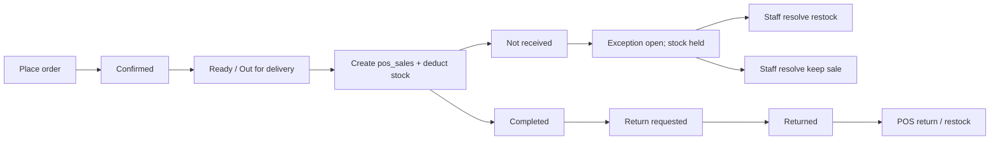
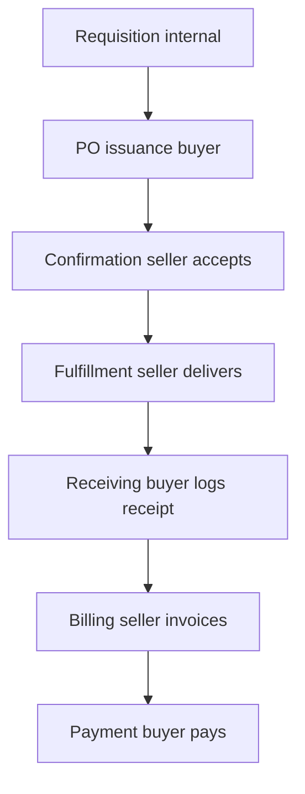

# Portal sales, PO/invoice lifecycle, exceptions & VHC

**Status:** Implemented (2026-07-23)  
**Product:** uventorybiz  
**Date:** 2026-07-23  
**Related:** [PORTAL_GUIDE.md](./PORTAL_GUIDE.md), [POS_GUIDE.md](./POS_GUIDE.md), [INVENTORY_TRANSFERS_AND_ISSUES_PLAN.md](./INVENTORY_TRANSFERS_AND_ISSUES_PLAN.md)

This document is the build plan for:

1. Portal customer orders as sales (stock + `/sales`)
2. Supplier PO confirm → ship → buyer receive → invoice
3. Tenant fulfillment exceptions (investigation hold)
4. System inventory category **Vehicles (VHC)**

---

## Decisions locked

1. **Portal customer order stock timing = A** — deduct stock and create a `pos_sales` row when staff first marks the order `ready_for_pickup` or `out_for_delivery`.
2. **PO/invoice flow** — align with standard procurement (below). Fix today’s gap where the business can receive without any supplier action.
3. **Fulfillment exceptions** — tenant staff queue; on customer `not_received`, **hold** stock (do not auto-restock) until staff resolves.
4. **Vehicles (VHC)** — add as a system inventory category.

---

## Problem summary

| Area | Today | Target |
|------|--------|--------|
| Portal customer orders | Status-only; no stock move; not on `/sales` | Same as POS sale at ready/out; returns restock; appear on Sales History |
| Supplier PO | Approved → visible; staff can **Receive** with no supplier action; free-form invoices | Confirm → ship → receive → invoice (gated) |
| Disputes | Notifications / status only | Exceptions queue + hold on `not_received` |
| Categories | MED/SUP/PPE/EMG/EQP/CON | + Vehicles (`VHC`) |

---

## Part A — Portal customer orders → POS sales

### Stock timing (A)

### Implementation notes

- Reuse/extend `finalizeSaleWithStock` in `server/modules/pos/pos.repository.ts` for portal lines at the order’s fulfillment `locationId`.
- Migration: nullable unique `portal_order_id` on `pos_sales` so `/sales` can show channel (POS vs Portal).
- Tenant **Online / Portal** register (or equivalent) so the sale can complete without an open cashier shift.
- Idempotent: repeating ready/out must not double-deduct.
- Cancel/reject before ready/out: no stock move.
- **Returned** (staff confirms): stock in + POS return linked to the portal sale; remove “refund manually in POS” copy.
- **not_received**: do **not** auto-restock — open an exception (Part C).
- No historical backfill of old portal orders into `pos_sales` unless requested later.

**Key files today:** `server/modules/portal/portal-orders.service.ts`, `client/src/pages/pos/SalesHistoryPage.tsx`, `client/src/pages/OrdersPage.tsx`.

---

## Part B — Supplier PO / invoice lifecycle

### Standard commercial sequence

**Today:** draft → approve → PO appears in supplier UI, but supplier has no real confirm/ship step; staff can **Receive** immediately. Invoice is a free-form submit.

**Confirm** (seller accepts the PO) and **invoice** (seller bills after buyer receipt) are **different steps and different buttons**.

### Target status map

Existing enum: `draft` | `pending_approval` | `approved` | `ordered` | `partially_received` | `completed` | `cancelled`.

| Step | Actor | System meaning | Status / fields |
|------|--------|----------------|-----------------|
| Create / approve | Buyer (staff) | PO issued to supplier | `approved` (visible in supplier portal) |
| **Confirm PO** | Supplier | Accepts PO (binding) | → `ordered` + `supplier_confirmed_at` |
| **Mark shipped** | Supplier | Goods/services sent | → new status **`shipped`** + `supplier_shipped_at` |
| **Receive** | Buyer (staff) | Inspect & log receiving | → `partially_received` / `completed` |
| **Submit invoice** | Supplier | Bill for received qty | invoice row; auto number; amount/date prefilled |
| Accept / pay | Buyer (staff) | Existing invoice PATCH | `accepted` → `paid` |

### Gating rules

- On `approved`, supplier CTA is **Confirm purchase order** (not invoice).
- Buyer **Receive** requires status **`shipped`** (explicit fulfillment before receiving). Soften later for services-only if needed.
- **Submit invoice** only when PO is `partially_received` or `completed`. Prefill:
  - **Invoice number** — auto `INV-YYYYMMDD-NNN` (read-only in UI)
  - **Amount** — received line totals (partial) or PO total when fully received; editable
  - **Invoice date** — today; editable
- At most **one non-rejected** invoice per `purchase_order_id`; resubmit only after `rejected`.
- Prefer PO-linked invoices as the happy path.

### Supplier portal actions by state

| PO state | Supplier sees |
|----------|----------------|
| `approved` | **Confirm purchase order** |
| `ordered` | **Mark as shipped** (awaiting buyer receive) |
| `shipped` | Waiting for buyer to receive |
| `partially_received` / `completed` | **Submit invoice** (if none active) |
| Has active invoice | Invoice status; no second submit |

### Schema / API

- Add enum value `shipped` to `purchase_order_status`.
- Columns on `purchase_orders`: `supplier_confirmed_at`, `supplier_confirmed_by_portal_user_id`, `supplier_shipped_at`, `supplier_shipped_by_portal_user_id`.
- Portal: `POST /api/portal/supplier/purchase-orders/:id/confirm`, `POST .../ship`.
- Staff receive: reject with a clear error unless status is `shipped`.
- Redefine **`ordered` = supplier confirmed** (document semantic change; backfill `supplier_confirmed_at` for existing `ordered` rows where sensible).

**Key files today:** `shared/schema.ts` (`purchaseOrderStatusEnum`), `server/modules/inventory/purchase-orders/`, `server/modules/portal/portal-orders.service.ts`, `client/src/portal/PortalSupplierOrdersPage.tsx`, `shared/portalOrders.ts` (`SUPPLIER_VISIBLE_PO_STATUSES`).

---

## Part C — Fulfillment exceptions

**Investigation hold:** while an `order_not_received` exception is open, inventory stays deducted until staff resolves.

### MVP

| Kind | Trigger | Staff resolutions |
|------|---------|-------------------|
| `order_not_received` | Customer reports not received | Restock + reverse portal sale **or** mark delivered (keep sale) |
| `order_return` | Customer `return_requested` | Approve → returned + restock **or** decline → completed |
| `invoice_dispute` | Optional / later | Accept / reject invoice |

- Small table `fulfillment_exceptions`: `id`, `tenant_id`, `kind`, `status` (`open`/`resolved`), FKs (`portal_order_id` / `supplier_invoice_id`), notes, `resolved_by`, `resolution`, timestamps.
- Staff UI: tab or page under orders (e.g. `/orders/exceptions`).
- Portal: “Under review” on the related order/invoice — no separate portal admin console.
- Keep existing notifications; deep-link to exceptions list.

**Out of MVP:** multi-party chat on exceptions, SLA timers, super-admin cross-tenant queue.

---

## Part D — Vehicles (VHC) inventory category

Add to `DEFAULT_INVENTORY_CATEGORIES` in `shared/inventoryCategories.ts`:

| Name | Slug | Prefix | fieldTemplate | sortOrder |
|------|------|--------|---------------|-----------|
| Vehicles | `vehicles` | `VHC` | `equipment` | 70 |

CSV aliases: `vehicle` / `vehicles` → `vehicles`. Existing tenants get the row via `ensureDefaultInventoryCategories` (no one-shot destructive migration required).

Note: business asset tags (`AST-######`) remain separate from inventory categories.

---

## Implementation checklist

1. ~~Portal order → `pos_sales` + stock at ready/out; return restock; sales channel badge~~ ✅
2. ~~PO enum `shipped` + supplier confirm/ship columns and APIs; gate staff receive~~ ✅
3. ~~Supplier invoice: one active per PO; auto numbers; prefills; stage-gated UI~~ ✅
4. ~~`fulfillment_exceptions` + staff queue + hold behavior on `not_received`~~ ✅
5. ~~Vehicles (VHC) default category~~ ✅
6. ~~Update [PORTAL_GUIDE.md](./PORTAL_GUIDE.md), [POS_GUIDE.md](./POS_GUIDE.md), changelog~~ ✅

Shipped in **uventorybiz 1.3.0** (`drizzle/0026`, `drizzle/0027` for return window + POS tenders).

---

## Out of scope

- Soft stock reservation at portal order `pending` / `confirmed`
- Historical portal order → `pos_sales` backfill
- Full three-way match / AP automation beyond gating + one invoice per PO
- Changing buyer internal requisition → PO create/approve (already exists)
