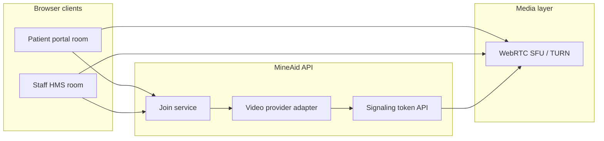

# Telehealth plan (WebRTC)

**Last updated:** June 15, 2026  
**Related:** [TELEHEALTH_UI.md](./TELEHEALTH_UI.md), [TELEHEALTH_APPOINTMENT_SYNC.md](./TELEHEALTH_APPOINTMENT_SYNC.md), [ENCOUNTER_LIFECYCLE_FRAMEWORK.md](./ENCOUNTER_LIFECYCLE_FRAMEWORK.md) §6, [APPOINTMENT_NOTIFICATIONS.md](./APPOINTMENT_NOTIFICATIONS.md), `server/modules/telecare/`

---

## Direction

MineAid telehealth uses **in-browser WebRTC (LiveKit)** by default. **Microsoft Teams** remains available as an alternate provider for comparison or legacy deployments — switch via `TELEHEALTH_PROVIDER`. UI copy and join behavior match the active provider.

| Aspect | LiveKit (default) | Teams (optional) |
|--------|-------------------|------------------|
| Video | In-app room (portal + staff HMS) | External Teams tab via Graph API |
| Provisioning | LiveKit room + JWT per participant | Graph `onlineMeetings` → shared `joinWebUrl` |
| Join API | Returns `{ room: { token, serverUrl, roomName } }` | Returns `{ joinUrl }` → `window.open` |
| Dedicated UI | Pre-join + in-call room — [TELEHEALTH_UI.md](./TELEHEALTH_UI.md) | External join card + Teams tab |
| Env vars | `LIVEKIT_*`, `TELEHEALTH_PROVIDER=livekit` | `TEAMS_GRAPH_*`, `TELEHEALTH_PROVIDER=teams` |

---

## Current scope (implemented)

- **Video provider:** **LiveKit WebRTC** (default via `TELEHEALTH_PROVIDER=livekit`); legacy Microsoft Teams optional (`teams.provider.ts`)
- **Sessions:** `telecare_sessions` linked to `appointments` with `modality = telehealth`; bidirectional FK repair in sync service
- **Provisioning:** LiveKit room created when visit is **confirmed**; portal/staff deep links stored on session
- **Join:** In-app room — portal `/portal/visits/:sessionId/join`, staff `/telecare/:sessionId`
- **Join window:** 15 minutes before start until `scheduled_end` (`appointments.duration_minutes` + session `scheduled_end`)
- **Patient consent:** Required before portal join (`patient_telehealth_consent_at`)
- **Staff hub:** `/telecare` — multi-tab queue (today, upcoming, live, recent, history), summary API, telehealth-only schedule modal
- **In-call UX:** 3-column shell — video, embedded encounter documentation, context/health tabs; open encounter → auto-join room
- **Sync:** `telecare-appointment-sync.service.ts` — appointments, sessions, portal requests, encounters kept aligned on terminal outcomes
- **Messaging:** Optional in-call `TelecareMessagingPanel` when portal messaging feature enabled
- **Patient email:** Portal video visit link on telehealth confirmation

---

## Target architecture (WebRTC)

### Components



1. **Signaling & tokens** — On join, server validates window + role, provisions room if needed, returns `{ roomId, token, wsUrl }` (exact shape depends on SFU). Tokens are short-lived and scoped to one session + role.
2. **SFU (Selective Forwarding Unit)** — Handles multi-party WebRTC without full mesh. Recommended options:
   - **LiveKit** (self-hostable on Railway, good SDK, matches schema enum) — **preferred default**
   - Daily.co / Twilio Video — managed SaaS if ops burden must stay minimal
   - mediasoup — full self-host only if LiveKit is not acceptable
3. **TURN** — Required for patients on restrictive mine-site networks. Configure via provider or dedicated TURN (e.g. coturn). Never ship production without TURN.
4. **Recording** — Optional phase; requires explicit consent (`recording_consent` on `telecare_sessions`) and provider-side egress.

### Server changes (high level)

| Area | Change |
|------|--------|
| `video-providers/types.ts` | Add `webrtc` / `livekit` provider id; token-based `ProvisionedVideoMeeting` (drop shared URL model) |
| `video-providers/livekit.provider.ts` (new) | Create room, mint patient/provider tokens |
| `telecare-join.service.ts` | Return `{ roomToken, roomName, serverUrl }` instead of `joinUrl`; same join window + status transitions |
| `telecare_sessions` | Keep `room_id`; deprecate `join_url_patient` / `join_url_provider` after migration (or store portal deep links only) |
| `telecare.routes.ts` | Extend `/join` response; add `/telecare/sessions/:id/room` for room bootstrap if needed |
| Email templates | Link to in-app room URL, not Teams |

### Environment (illustrative)

```env
TELEHEALTH_PROVIDER=livekit          # livekit | daily | twilio | webrtc
LIVEKIT_API_KEY=
LIVEKIT_API_SECRET=
LIVEKIT_WS_URL=wss://...
# Optional dedicated TURN when not bundled with provider
TURN_URLS=
TURN_USERNAME=
TURN_CREDENTIAL=
```

Remove Teams Graph vars only when Teams is fully retired from all environments.

---

## Provider selection (LiveKit vs Teams)

1. Set **`TELEHEALTH_PROVIDER=livekit`** (default) or **`teams`** in `.env`.
2. Configure the matching credentials (see `.env.example`).
3. UI automatically shows “Join video visit” vs “Join Teams visit” and in-app room vs external tab.
4. Per-session `telecare_sessions.video_provider` can differ for legacy sessions.

---

## Dedicated UI — required

Teams allowed a **link-out** model: no in-app video. WebRTC **must** run inside MineAid, so a dedicated telehealth room UI is required for both audiences.

| Surface | Today | WebRTC target |
|---------|-------|---------------|
| Patient portal | `/portal/visits/:sessionId/join` — landing + “Open Teams” | Same route → **pre-join + in-call room** |
| Staff HMS | Appointments “Join Teams” → new tab | **`/telecare/:sessionId`** room + optional embed/link from Medical Visit |
| Sidebar “Telehealth” page | None | Optional **queue/dashboard** (medium phase); not required for MVP |

Full screen specs, states, and components: **[TELEHEALTH_UI.md](./TELEHEALTH_UI.md)**.

---

## Appointment confirmation model (telehealth)

Unchanged business rules; only the join artifact changes.

| Initiator | Staff action | Patient action | Video access |
|-----------|--------------|----------------|--------------|
| **Patient** (portal request) | Approve → `confirmed` | None (request = intent) | Email with portal room link on approval |
| **Staff** (schedule) | Creates `scheduled` | Confirm in portal | Email with room link on patient confirm |
| **Either** (schedule change) | Updates slot/provider/modality | Re-confirm if was `confirmed` | New room token after re-confirm |

Join window (unchanged): **15 minutes before** scheduled start through **90 minutes after** (`JOIN_EARLY_MINUTES` / `JOIN_LATE_MINUTES` in `telecare-join.service.ts`).

Session status transitions on join (unchanged):

- Patient joins first → `waiting_room`
- Provider joins → `in_progress` (+ `actual_start`)

See [APPOINTMENT_NOTIFICATIONS.md](./APPOINTMENT_NOTIFICATIONS.md) for the full alert matrix (update copy from “Teams link” to “Join your video visit”).

---

## Migration from Teams (optional)

1. Default new deployments to **`TELEHEALTH_PROVIDER=livekit`**.
2. Existing Teams sessions remain joinable until expired (or re-provision on next join).
3. **`TelecareJoinButton`** and portal copy are provider-aware — no Teams labels when LiveKit is active.
4. Teams provider retained in `teams.provider.ts` for A/B testing — remove only after soak period.

---

## Encounter integration

Telecare flow per [ENCOUNTER_LIFECYCLE_FRAMEWORK.md](./ENCOUNTER_LIFECYCLE_FRAMEWORK.md) §6:

- Pathway: `telehealth_scheduled` / `telehealth_follow_up`
- Staff documents in **Medical Visit** (`/encounter`) — can open room in split view or separate tab; see UI doc
- Dispositions: `refer_in_person`, `unable_to_assess_remote`, `continue_telehealth`

---

## Future: preferred practitioner selection

**Not implemented.** Planned after WebRTC MVP.

### Goals

- Allow patients to **request or prefer a specific provider** when booking telehealth (and optionally in-person)
- Respect tenant configuration: open scheduling vs assigned panel only
- Fall back to clinic coordinator / role-based routing when preferred provider is unavailable

### Proposed design notes

1. **Portal request fields** — `preferredMedicalStaffId` (optional) on `portal_appointment_requests`; searchable provider list (telehealth-enabled staff).
2. **Staff confirm** — Pre-fill provider from preference; staff may override; calendar conflict check.
3. **Staff-initiated telehealth** — Provider chosen by scheduler; patient still confirms unless from portal request.
4. **Notifications** — Preferred provider alerted on request/assignment.
5. **FHIR** — `Appointment.participant` with `PractitionerRole` on export.

### Dependencies

- Provider availability / shift calendar (optional)
- Tenant setting: `portal.allowProviderPreference`
- Telehealth-capable flag per user or role

---

## Future phases (summary)

| Phase | Item |
|-------|------|
| **Done** | LiveKit WebRTC, portal + staff room UI, token join API, staff `/telecare` queue |
| Near-term | Reminder notifications (pre-visit SMS/email) |
| Medium | Preferred practitioner selection (above) |
| Long | Multi-party visits (interpreter, supervisor) |
| Long | Recording with consent + retention policy |
