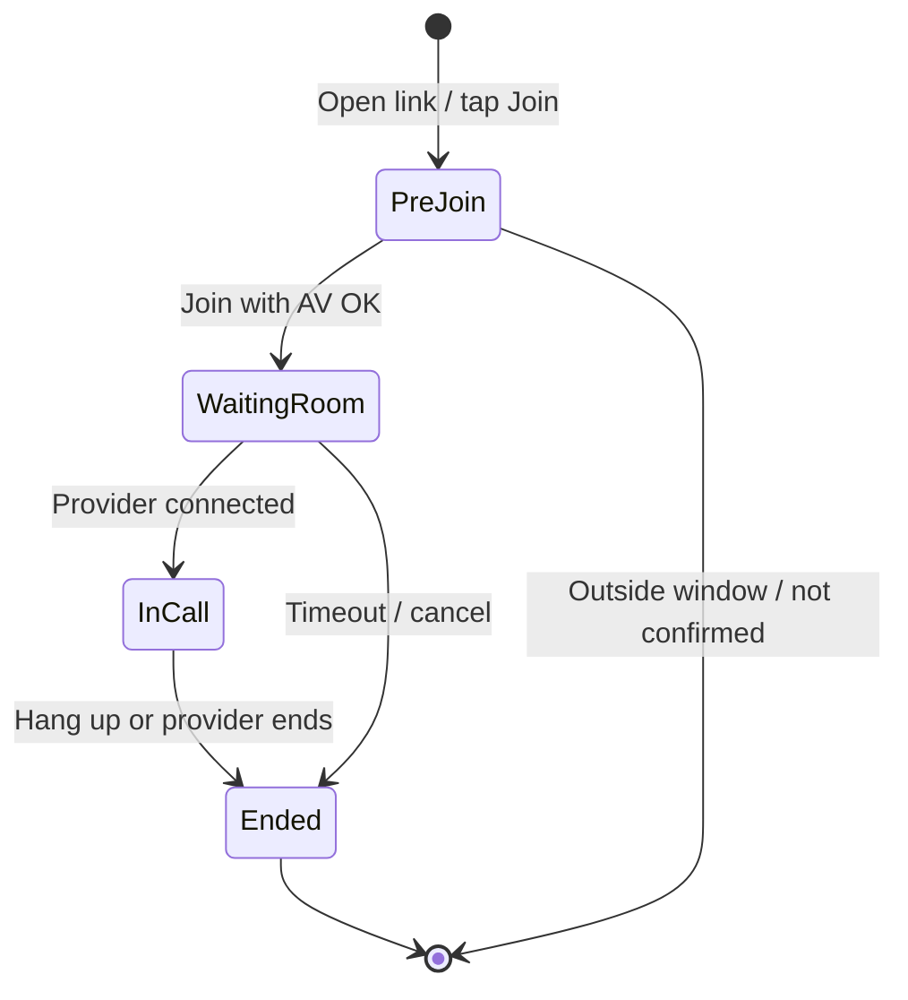

# Telehealth UI specification (WebRTC)

**Last updated:** June 19, 2026  
**Related:** [TELEHEALTH_PLAN.md](./TELEHEALTH_PLAN.md), [TELEHEALTH_APPOINTMENT_SYNC.md](./TELEHEALTH_APPOINTMENT_SYNC.md), [ENCOUNTER_LIFECYCLE_FRAMEWORK.md](./ENCOUNTER_LIFECYCLE_FRAMEWORK.md) §6, [PORTAL_STYLES.md](./PORTAL_STYLES.md)

---

## Why a dedicated UI is required

With **Microsoft Teams**, MineAid only needed a join button that opened an external meeting URL. **WebRTC video runs in the browser**, so MineAid must own:

- Camera/microphone permission prompts
- Pre-join device check (preview, mute, camera off)
- In-call layout (local + remote video, controls)
- Waiting room and session-ended states
- Reconnection and error handling

There is **no dedicated staff telehealth page today**. The portal has a minimal join landing page (`PortalTelecareJoinPage`) that still delegates video to Teams. WebRTC replaces that landing page with a full room experience and adds a matching staff room.

**Update (4.28.0):** Staff **`/telecare`** Telehealth hub and full in-call room (`/telecare/:sessionId`) are implemented — see inventory below.

**Update (4.31.0):** In-call room uses **fullscreen light shell** (outside `MainLayout`); visit metadata in context panel **Appt** tab; session time warnings as **inline banners** (not blocking modals); portal patient room uses `telecare-session--portal` tokens. See [PORTAL_STYLES.md](./PORTAL_STYLES.md) § Telecare.

---

## Current UI inventory

| Location | Component / route | Role | Behavior (4.28.0) |
|----------|-------------------|------|-------------------|
| Portal | `/portal/visits/:sessionId/join` | Patient | Consent → pre-join → waiting → in-call → ended |
| Portal | `PortalHomePage`, `PortalAppointmentsPage` | Patient | Join CTA when in window; request status reflects visit outcome |
| Staff | `/telecare` | Provider | **Telehealth hub** — tabs, filters, summary, schedule video visit |
| Staff | `/telecare/:sessionId` | Provider | Encounter setup → auto-join → 3-column in-call room |
| Staff | `AppointmentsTable` | Provider | Join visit → telecare room |
| Staff | `MedicalVisit` (`embed=1`) | Provider | Embedded in telecare Documentation tab |
| Staff | Sidebar | — | **Telehealth** nav item |

---

## Target routes

| Route | Audience | Purpose |
|-------|----------|---------|
| `/portal/visits/:sessionId/join` | Patient | Pre-join → waiting room → in-call → ended (reuse existing URL from emails) |
| `/telecare/:sessionId` | Staff (clinical) | Same room states; requires staff auth + clinical access |
| `/telecare` | Staff (clinical) | Telehealth hub — queue, filters, schedule telehealth-only visits |
| `/telecare/:sessionId` | Staff (clinical) | Pre-join → encounter setup → in-call → ended |

Deep links from Appointments and portal lists navigate to these routes instead of calling `window.open`.

---

## User flows

### Patient



1. **Entry** — From portal home, appointments list, or email link (`/portal/visits/:sessionId/join`).
2. **Gate** — Show error card if appointment not confirmed, outside join window, or session cancelled (reuse logic from `canPatientJoinTelecare`).
3. **Pre-join** — Device preview, toggle mic/camera, “Join visit” CTA.
4. **Waiting room** — Message: “Your clinician will join shortly”; optional self-reported location reminder.
5. **In-call** — Remote video primary, local PiP, controls (mute, camera, leave).
6. **Ended** — Summary: duration, link back to appointments; no PHI in URL params.

### Staff (provider)

Same room states with different copy and permissions:

1. **Entry** — Appointments table “Join visit”, Medical Visit telehealth banner, or `/telecare/:sessionId`.
2. **Pre-join** — Same device check.
3. **In-call** — Entering call sets session `in_progress` (existing join service behavior).
4. **Documentation** — Prominent “Open encounter” link to `/encounter?...` (or split layout on wide screens — phase 2).
5. **End visit** — Leave room + optional “Complete session” → `telecare_sessions.status = completed`.

---

## Screen specification

### 1. Pre-join

| Element | Notes |
|---------|--------|
| Header | Tenant branding (portal primary color); visit time + provider name |
| Video preview | `<video>` local stream; placeholder if camera denied |
| Mic / camera toggles | Persist choices into room join |
| Primary CTA | “Join visit” — disabled until permissions granted or user acknowledges audio-only |
| Help text | Browser permission guidance; mine-site network tip if connection fails |
| Error states | Not confirmed, outside window, session not found |

### 2. Waiting room (patient)

| Element | Notes |
|---------|--------|
| Status | “Waiting for your clinician…” |
| Local preview | Optional small preview |
| Leave | “Cancel and go back” → portal appointments |
| Timer | Elapsed wait (optional) |

### 3. In-call room

| Element | Notes |
|---------|--------|
| Remote video | Large stage; avatar fallback when camera off |
| Local video | Picture-in-picture, draggable on desktop |
| Control bar | Mute, camera, leave (red) |
| Connection badge | Reconnecting / poor network |
| Staff only | “Open encounter documentation” button |
| Mobile | Full-screen remote; controls overlay; respect safe areas |

### 4. Session ended

| Element | Notes |
|---------|--------|
| Message | “Visit ended” + time |
| Actions | Back to appointments (portal) or appointments list (staff) |
| No auto-redirect | User dismisses explicitly |

---

## Component structure (proposed)

```
client/src/
  components/telecare/
    TelecareRoom.tsx           # Orchestrator: state machine + provider hook
    TelecarePreJoin.tsx
    TelecareWaitingRoom.tsx
    TelecareCallLayout.tsx     # Video tiles + control bar
    TelecareControlBar.tsx
    TelecareSessionEnded.tsx
    TelecareJoinGate.tsx       # Errors: window, confirmation, not found
    useTelecareRoom.ts         # Join API, WebRTC/LiveKit client, reconnect
  portal/
    PortalTelecareJoinPage.tsx # Thin wrapper → TelecareRoom (apiPrefix portal)
  pages/
    TelecareRoomPage.tsx       # Staff wrapper → TelecareRoom (apiPrefix staff)
```

Shared `TelecareRoom` keeps patient and staff UX consistent; `apiPrefix` selects `/api/portal/telecare/...` vs `/api/telecare/...`.

### Replace `TelecareJoinButton` behavior

| Before (Teams) | After (WebRTC) |
|----------------|----------------|
| POST `/join` → `window.open(joinUrl)` | POST `/join` → receive token → `navigate(/telecare/:id)` or `/portal/visits/:id/join` |
| Toast “Opening Microsoft Teams” | Toast “Connecting…” only on failure |

Button labels: **“Join video visit”** (not “Join Teams”).

---

## API contract (join response — target)

Extend existing join endpoints; frontend room page consumes:

```json
{
  "videoProvider": "livekit",
  "session": { "id": "...", "status": "waiting_room", "scheduledStart": "..." },
  "room": {
    "roomName": "tc_abc123",
    "token": "<jwt>",
    "serverUrl": "wss://livekit.example.com"
  }
}
```

Legacy `joinUrl` may remain during migration for Teams-only sessions.

---

## Medical Visit integration

Telehealth encounters are documented in **Medical Visit**, not inside the video chrome.

**MVP**

- Room page shows sticky **“Document visit”** → opens `/encounter` in new tab or same window (user choice).
- Medical Visit telehealth section shows **“Return to video”** when session is `in_progress` and links back to `/telecare/:sessionId`.

**Phase 2 (optional)**

- Wide viewport: resizable split pane (room left, encounter form right) — only if clinical team wants single-screen workflow.

---

## Accessibility & clinical UX

- All controls keyboard-focusable; visible focus rings.
- Mute/camera buttons expose `aria-pressed` state.
- Live region announces “Clinician joined” / “Connection lost”.
- Do not block leave on accidental navigation — confirm dialog if call active.
- No visit recording indicator unless recording is enabled and consented.

---

## Copy & branding updates

Replace Teams-specific strings project-wide when WebRTC ships:

| Location | Old | New |
|----------|-----|-----|
| `TelecareJoinButton` default label | Join Teams visit | Join video visit |
| `portalUi.tsx` location label | Virtual (Teams) | Virtual (video) |
| `PortalTelecareJoinPage` description | Microsoft Teams… | Built-in secure video visit in your browser… |
| Email templates | Teams link | Join your video visit (portal link) |

---

## Testing checklist

- [ ] Join inside / outside 15-minute early window
- [ ] Patient blocked until appointment confirmed
- [ ] Patient waiting room → provider join → both see/hear
- [ ] Mic/camera toggle before and during call
- [ ] Leave and rejoin within late window
- [ ] Session status: `waiting_room` → `in_progress` → `completed`
- [ ] Restrictive network (TURN required)
- [ ] Mobile Safari + Chrome Android
- [ ] Staff “Open encounter” round-trip

---

## Implementation phases

| Phase | Deliverable |
|-------|-------------|
| **1** | `TelecareRoom` + portal route; staff `/telecare/:sessionId`; updated join button navigation |
| **2** | Medical Visit cross-links; connection quality UX |
| **3** | Staff `/telecare` queue page; provider “admit from waiting room” if SFU supports it |
| **4** | Split-view documentation (optional) |
